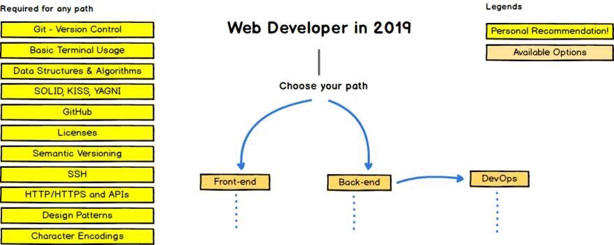
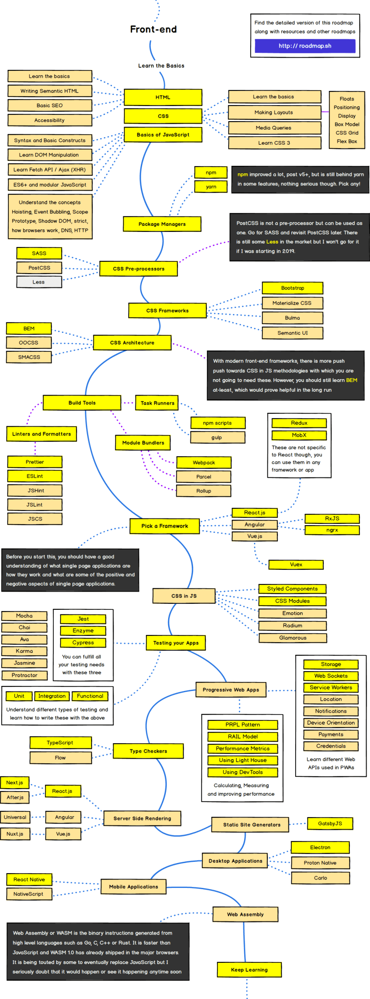
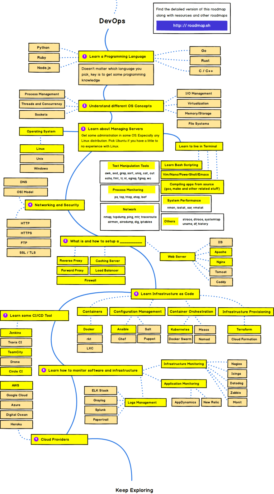

<!-- # Welcome to Note Pro

For full documentation visit [mkdocs.org](http://mkdocs.org).

## Commands

* `mkdocs new [dir-name]` - Create a new project.
* `mkdocs serve` - Start the live-reloading docs server.
* `mkdocs build` - Build the documentation site.
* `mkdocs help` - Print this help message.

## Project layout

    mkdocs.yml    # The configuration file.
    docs/
        index.md  # The documentation homepage.
        ...       # Other markdown pages, images and other files. -->

# Roadmap web developer in 2019

The purpose of these roadmap is to give you an idea about the landscape and to guide you if you are confused about what to learn nexet and not to encourage you to pick what is hip and trendy. You should grow some understanding of why one tool would better be suited for some cases than the other and remember hip and trendy never means beast suited for the job.

## FRONT-END Roadmap

## BACK-END Roadmap

## DEV-OPS Roadmap

Get more information at [here](https://dev.to/realabbas/roadmap-to-web-developer-in-2019-1o1k?fbclid=IwAR2Hg8MWJD6SbaemBHogUSoouoZOydvzTDN_2jEWzW45lJw5ib8M-VW5i7M).
