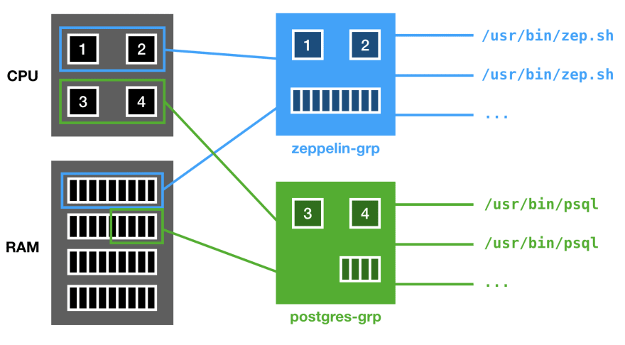
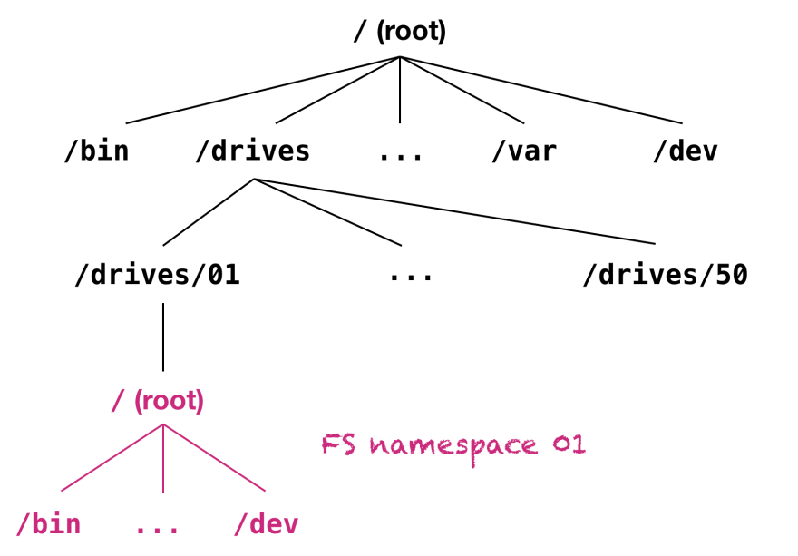
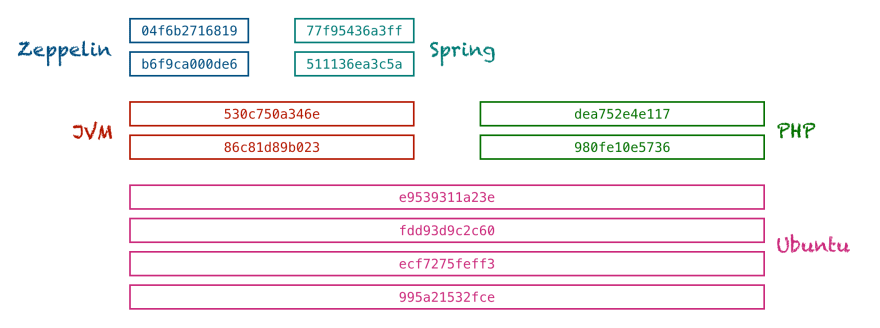
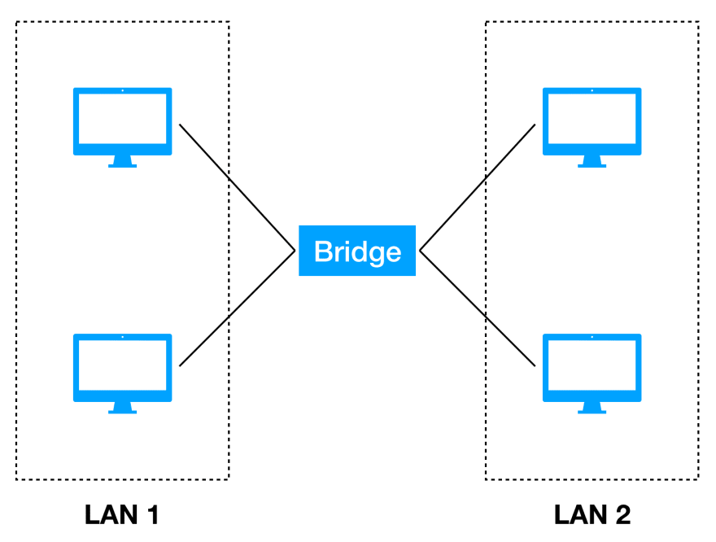
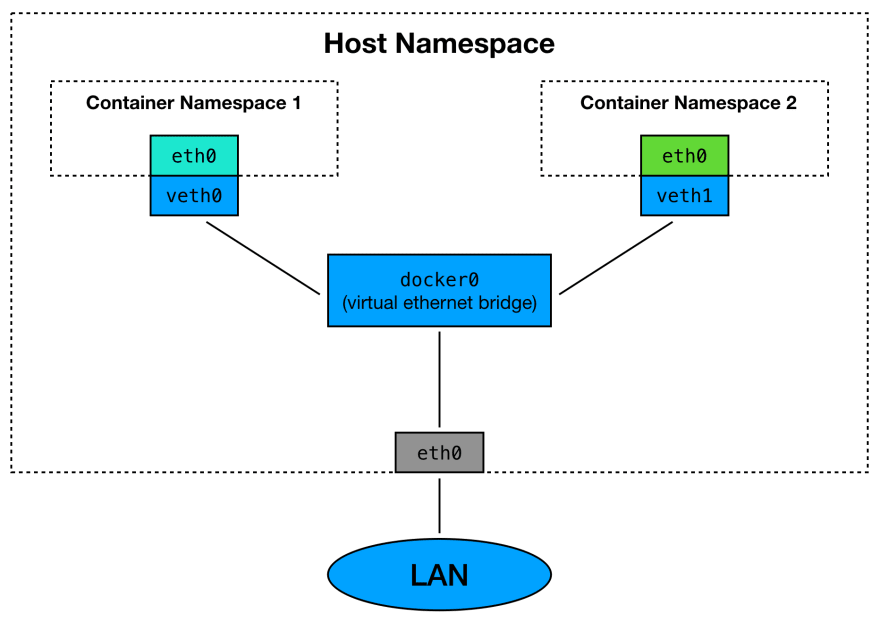

# Docker Demystified

<hr/>

## Container isolation

Docker achieves isolation of different containers through the combination of four main concepts: 1) _cgroups_, 2) _namespaces_, 3) stackable _image-layers_ and _copy-on-write_, and 4) _virutal network bridges_.

## Control Groups (cgroups)

The Linux operating system manages the available hardware resources (memeory, CPI, disk I/O, network I/O,...) and provides a convenient way for processes to access and utilize them. The CPU scheduler of Linux, for example, takes care that every thread will eventually get some time on a CPU core so that no applications are stuck waiting for CPU time.

Control group (cgroups) are a way to assign a subset of resources to a specific group of processes. This can be used to, ensure that even if your CPU is supper busy with Python scripts, your PostgreSQL database still gets dedicated CPU and RAM.



## Namespaces

While cgroups isolate hardware resources, namespaces isolate and virtualize system resources. Examples of system resources that can be virtualized include process IDs, hostnames, user IDs, network access, interprocess communication, and filesystems.

### PID Namespaces

The Linux operating system organizes processes in a so called process tree. The tree root is the first process that gets started after the operating system is bootes and it has the PID 1. As only one process tree can exist and all other processes (e.g Firefox, termial emulators, SSH servers) need to be (directly or indirectly) started by this process. Due to the fact that this process initializes all other processes it is often referred as the _init_ process.

```bash
1 /sbin/init
+-- 196 /usr/sbin/syslogd -s
+-- 354 /usr/sbin/cron -s
+-- 391 login
    +-- 400 bash
        +-- 701 /usr/local/bin/pstree
```

Using PID namespaces virtualizes the PIDs for a specific process and all its sub processes, making it think that it has PID 1. It will then also not being able to see any other processes except its own children.

```bash
1 /sbin/init
|
+ ...
|
+-- 506 /usr/local/zeppelin
    1 /usr/local/zeppelin
    +-- 2 interpreter.sh
    +-- 3 interpreter.sh
+-- 511 /usr/local/zeppelin
    1 /usr/local/zeppelin
    +-- 2 java
```

### Filesystem Namespaces

Another use case for namespaces is the Linux filesystem. Similar to PID namespaces,filesystem namespaces virtualize and isolate parts of a tree - in this case the filesystem tree. The Linux filesysem is organizws as a tree and it has a root, typically referred to as `/`.

In order to achieve isolation on a filesysem level, the namespace will map a node in the filesystem tree to a virtual root inside that namespace. Browsing the filesystem inside that namespace, Linux does not allow you to go beyond your virtualized root.



### Other Namespaces

Besides the PID and the filesystem namespaces there are also [other kinds of namespaces](https://en.wikipedia.org/wiki/Linux_namespaces#Namespace_kinds). Docker allows yout to utilize them in order to achieve the amount of isolation you require. The user namespace, e.g., alows you to map a user inside a container to a different user outside.

## Stackable Image Layers and Copy-On-Write

Docker persists images in _stackable layers_. A layer contains the changes to the previous layer.If you install first Python and then copy a Python script, your image will have two additional layers: One containing the Python executables and another one containing the script.



in order not to store Ubuntu three times, layers are immutable and shared. Docker uses _copy-on-write_ to nly make a copy of a file if there are changes. The combination of stackable layers, copy-on-write, and filesystem namespaces anable you to run a container completely independent of the things "installed" on the Docker host without wasting a lot of space.

## Virtual Network Bridge

The last building block, the _virtual network bridge_, helps us in isolating the network stack inside a container.

A network bridge is a computer networking device that creates a single aggregate network from multiple communication networks or network segments. Let's look at a typical setup of a physical network bridge connecting two network segments (LAN 1 and LAN 2):



In order to isolate the networking of containers, Docker allows you to create a virtual network interface for each container. It then connects all the virtual network interfaces to the host network adapter.



Docker gives you a lot of freedom in configuring the bridge, so that you can expose only specific ports to the outside world or directly wire two containers together(e.g a database container and an application which needs access to it) without exposing anything to the outside.

<hr/>

Get more information at [here](https://dev.to/frosnerd/docker-demystified-27kl).
