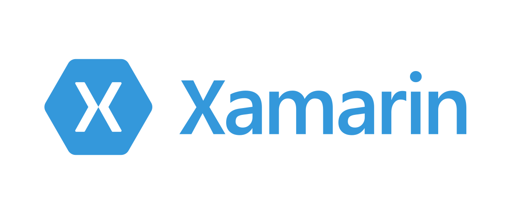

# Overview Pathways to Mobile Development

## Native Approach

The native approach is specifically adopted while building apps for a specific platform. Native apps have access to all the platform specific features since it's targeted specifically towards it. Performance is at it's best while using natice. For eg.

- Java/Kotlin for Native Android.
- Objective-C/Swift for Natice iOS.

## Web Approach

### Cordova

These apps are built using web technologies like HTML, CSS, Javascript, etc. and uses webview to render the UI on mobile. It's very easy to build simple apps using Cordova but can have a hard time with big and complex apps. Plugins support is wide for accessing platform-specific features. These technologies have become legacy now and the world is moving towards adoption of cross-platform approach and PWA's.

### PWA

Progressive Web Aps is one of the trending topics for now and utilize service workers to provide offline access to apps once it's cached. You can beautify your apps to peovide native feel. it can also access most of platform & device specific features and makes the user feel like using the natice app. One can use popular frameworks like Angular, React, etc to build these apps and enable PWA functionality. These are more of web app which provides a look and feel of native apps on mobile.

You can refer the below link to know what's supported on PWA's as of now: [here](https://whatwebcando.today/)

## Cross-Platform Approach

A cross-platform approach is specifically adopted to build apps that can be targeted for multiple platforms. It has access to mos of the platform-specific features but not all. Performance is somewhat close to native.

### Xamarin

Xamarin platform is a one-top for the development of mobile and desktop apps from Microsoft. The developer can use C# or F# for development. It fives the feel of native as per platform specific UI Layouts. Its mostly adopted by people who are more familiar with Microsoft dotNet technology to save learning efforts and get going for mobile development.

### React Native

React Native is from Facebook and is widely used in the development of cross-platform mobile apps. It mostly adopted by people familiar with Web Frameworks like React & Angular to save learning efforts foe mobile development. Though it's still in Bete people have already started using it in production.

### Flutter

Flutter platform is recently the latest one from Google and can be considered as a tough contender in the cross-platform world. It uses Dart language for development and widely gaining popularity in recent times. There is also news for the launch of a new mobile OS called Fuchsia and Flutter is supposed to support its development once the OS is launched. Once Fuchsia is launched flutter will probably be the topmost prefered platform for mobile development.

## What should I go forward with?

With the availability of so many options, one will really have a hard time to conclude on a platform. While concluding on the platform one needs to consider the below points:

- **Platform Support**: This the first and the most important questionn to ask while evaluating apps requirement. You should probably be asking what will be the supported platform for the application. Will it have the support of only Android, iOS or both or it should also support Web. If it only Android or iOS you should more inclined toward native approaches rather than considering Web or Cross Platform.
- **Application Functional Specs**: Its the most important of all to consider what all functionalities the app needs. For example, PWA's doesn't support all device functionalities and if your app demands one you cannot go forward with the PWA's. Native approaches have access to all new platform-specific features and with cross-platfrom or web approaches it takes time to get the support for it.
- **Goto Market Time:** Goto market time is bisically the time you need to ship the app to production. If app should have support for multiple platform (Android, iOS, Web) and the timeline is stringent you should consider Cross Platform approaches rather than Native on. Natice apps will need native developers for each platform which adds up time considering you have limited developers.
- **Budge**: The budget also helps in deciding the platform. Less budget and multiple platform support will push you to choose a web/cross-platform approach since a single developer can develop apps for multiple targets (Android, iOS).
- **Current Expertise**: You should also be considering the current expertise of your team. Every new platform has its own learning curve and it won't be a good choice to change technology every time for a new app. Developers will be more comfortable with platforms they have experience in rather than adopting a new one. If your team is more of the web then you should be inclined towards web-based technologies like React or Angular. If your team is of dotnet developers probably Xamarin will be the way suitable for you.

Get more information at [here](https://medium.com/@KPS250/pathways-to-mobile-development-750ba1a26ee3).
