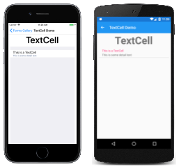
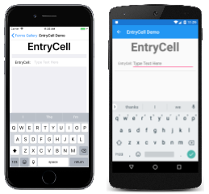

# Controls Reference

_A Description of all the visual elements used to construct a Xamarin.Forms application_.

The visual interface of a Xamarin.Forms application is constructed of objects that map to the native controls of each target platform. This allows platform-specific applications for iOS, Android, and the Universal Windows Platform to use Xamarin.Forms code contained in a [.NET Standard library](https://docs.microsoft.com/en-us/xamarin/cross-platform/app-fundamentals/net-standard) or a [Shared Project](https://docs.microsoft.com/en-us/xamarin/cross-platform/app-fundamentals/shared-projects).

The four main control groups used to create the user interface of a Xamarin.Forms application are shown in these four articles:

- [Pages](https://docs.microsoft.com/en-us/xamarin/xamarin-forms/user-interface/controls/pages)
- [Layouts](https://docs.microsoft.com/en-us/xamarin/xamarin-forms/user-interface/controls/layouts)
- [Views](https://docs.microsoft.com/en-us/xamarin/xamarin-forms/user-interface/controls/views)
- [Cells](https://docs.microsoft.com/en-us/xamarin/xamarin-forms/user-interface/controls/cells)

A Xamarin.Forms page generally occupies the entire screen. The page usually contains a layout, which contains views and possibly other layouts. Cells are specialied components used in connection with [`TableView`](https://docs.microsoft.com/en-us/xamarin/xamarin-forms/user-interface/controls/views#tableView) and [`ListView`](https://docs.microsoft.com/en-us/xamarin/xamarin-forms/user-interface/controls/views#listView).

In the four articles on [Pages](https://docs.microsoft.com/en-us/xamarin/xamarin-forms/user-interface/controls/pages), [Layouts](https://docs.microsoft.com/en-us/xamarin/xamarin-forms/user-interface/controls/layouts), [Views](https://docs.microsoft.com/en-us/xamarin/xamarin-forms/user-interface/controls/views) and [Cells](https://docs.microsoft.com/en-us/xamarin/xamarin-forms/user-interface/controls/cells), each type of control is described with links to its API documentation, an article describing its use (if one exists), and one or more sample programs(if they exist). Each type of control is also accompanied by a screenshot showing a page from the [FormsGallery](https://developer.xamarin.com/samples/FormsGallery/) sample running on iOS, Android, and UWP devices. Below each screenshot are links to the source code fot the C# page, the quivalent Xaml page, and (when appropriate) the C# code-behind file for the Xaml page.

A cell is a specialized element used for items in a table and describes how each item in a list should be rendered. The [Cell](https://docs.microsoft.com/en-us/dotnet/api/xamarin.forms.cell) class derives from [Element](https://docs.microsoft.com/en-us/dotnet/api/xamarin.forms.element), from which [VisualElement](https://docs.microsoft.com/en-us/dotnet/api/xamarin.forms.element) also derives. A cell is not itself a visual element; it is instead a template for creating a visual element.

## Cells

Xamarin.Forms supports the following cell types:

### TextCell

A [`TextCell`](https://docs.microsoft.com/en-us/dotnet/api/xamarin.forms.textcell) displays one or two text strings. Set the [`Text`](https://docs.microsoft.com/en-us/dotnet/api/xamarin.forms.textcell.text#Xamarin_Forms_TextCell_Text) property and, optionally, the [Detail](https://docs.microsoft.com/en-us/dotnet/api/xamarin.forms.textcell.detail#Xamarin_Forms_TextCell_Detail) property to these text strings.

### ImageCell

The [`ImageCell`](https://docs.microsoft.com/en-us/dotnet/api/xamarin.forms.imagecell) displays the same information as [`TextCell`](https://docs.microsoft.com/en-us/xamarin/xamarin-forms/user-interface/controls/cells#textCell) but includes a bitmap that you set with the [`Source`](https://docs.microsoft.com/en-us/dotnet/api/xamarin.forms.image.source#Xamarin_Forms_Image_Source) property.

### SwitchCell

The [`SwitchCell`](https://docs.microsoft.com/en-us/dotnet/api/xamarin.forms.switchcell) contains text set with the [`Text`](https://docs.microsoft.com/en-us/dotnet/api/xamarin.forms.switchcell)' property and on/off switch initiallly set with the Boolean [On](https://docs.microsoft.com/en-us/dotnet/api/xamarin.forms.switchcell.on#Xamarin_Forms_SwitchCell_On) property. Handle the Onchanged event to be notified when the On property changes.

### EntryCell

The [`EntryCell`](https://docs.microsoft.com/en-us/dotnet/api/xamarin.forms.entrycell) defines a [`Label`](https://docs.microsoft.com/en-us/dotnet/api/xamarin.forms.entrycell.label#Xamarin_Forms_EntryCell_Label) property that identifies the cell and a single line of editable text in the [`Text`](https://docs.microsoft.com/en-us/dotnet/api/xamarin.forms.entrycell.text#Xamarin_Forms_EntryCell_Text) property. Handle the [`Completed`](https://docs.microsoft.com/en-us/dotnet/api/xamarin.forms.entrycell.completed) event to be notified when the user has completed the text entry.

Get more information at [here](https://docs.microsoft.com/en-us/xamarin/xamarin-forms/user-interface/controls/index).
