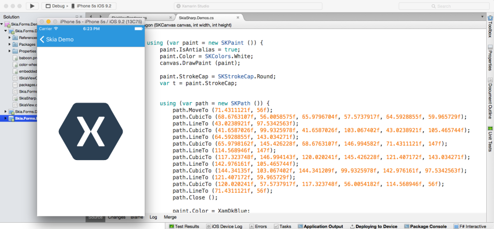

# Cross-Platform 2D Graphics with SkiaSharp

SkiaSharp provides a powerful C# API for doing 2D graphics powered by [Google's Skia library](http://skia.org/), the same library that powers Google Chrome, Firefox and Android's graphic stacks.

SkiaSharp ships conveniently as a [cross platform NuGet package](https://www.nuget.org/packages/SkiaSharp), and supports the following platforms out of the box: MacOS X, Android and iOS with Mono and the Windows Desktop with .NET. As NuGet evolves, we'll offer this for .NET Core and assorted Linux distributions (In the meantime if you need it now, you can build [SkiaSharp](http://github.com/mono/SkiaSharp) yourself).

##Getting Started

First, install the SkiaSharp NuGet and then out our [Introduction](https://developer.xamarin.com/guides/cross-platform/drawing/).

To help you start writing drawing code today, take a look at the landing page for [SkiaSharp](https://github.com/mono/SkiaSharp).

## Why We Chose Skia

While Mono has supporyed System.Drawing for a while, and we build a [CoreGraphics-powered](https://github.com/mono/sysdrawing-coregraphics) version for Mac/iOS, it has never been a pixel-perfect match for the original .NET implementation of System.Drawing. Mono.Cairo is also generally available, but has some limitations that are difficult to work.

Skia gives us the same graphics output across all platforms, is actively maintained and offers great features not found elsewhere, like filters and hardware accelerated graphics.

## The Future

SkiaSharp is a work in progress that we're sharing with our comminity. While we have bound important parts of the Skia API, much work remains to be done. We're using the stable C API surfaced by Skia, and our plan is to continue contributing our work to the C bingings of Skia to provide full coverage to the APIs.

Get more information at [here](https://devblogs.microsoft.com/xamarin/cross-platform-2d-graphics-with-skiasharp/).
