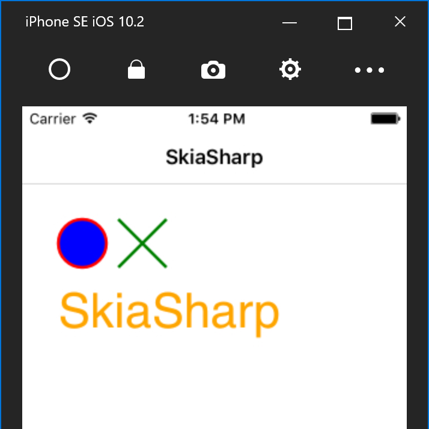

# Cross Platform Drawing with SkiaSharp

<hr/>

We're going to use XAML with [Xamarin.Forms](https://developer.xamarin.com/guides/xamarin-forms/getting-started/) to create our app, but we could use any of the native Xamarin or Windows platforms. The app we create will draw shapes, paths and text on the screen:



To get started, let's create a new Xamarin.Forms app in VS. Once the app is created, install the [SkiaSharp](https://www.nuget.org/packages/SkiaSharp) NuGet and the [SkiaSharp.Views.Forms](https://www.nuget.org/packages/SkiaSharp.Views.Forms) NuGet in all of the projects.

The SkiaSharp NuGet contains the native rendering engine for all the platforms, but this is just for in-memory rendering. To dispay the rendered images on the screen, we can make use of the various views in the SkiaSharp.Views.Forms NuGet.

## Adding SkaSharp Views

Once the NuGets are installed, we can add the SkiaSharp view to the XAML. Here, we're adding a [SKCanvasView](https://developer.xamarin.com/api/type/SkiaSharp.Views.Forms.SKCanvasView), the CPU-based drawing surface, but we could also use the [SKGLView](https://developer.xamarin.com/api/type/SkiaSharp.Views.Forms.SKGLView), the GPU-based drawing surface:

```xml
<ContentPage ... xmlns:views="clr-namespace:SkiaSharp.Views.Forms;assembly=SkiaSharp.Views.Forms">
    <Grid>
        <views:SKCanvasView PaintSurface="OnPainting" />
    </Grid>
</ContentPage>
```

Then we add the event handler in the code-behind for the page:

```csharp
using SkiaSharp;
using SkiaSharp.Views.Forms;

private void OnPainting(object sender, SKPaintSurfaceEventArgs e)
{
    // we will draw here
}
```

## Drawing with SkiaSharp

Drawing in SkiaSharp takes the form of three basic steps:

1. Get a surface to hold on drawing.
2. Get a canvas to draw on
3. Draw on nthe canvas with paint

The three main components are the SKSurface, the SKCanvas,and the SKPaint.

The [SKSurface](https://developer.xamarin.com/api/type/SkiaSharp.SKSurface/) is the layer that directs drawing commands from SkiaSharp onto the underlying native drawing area. This area could be a memory location for software drawing, a framebuffer ID for an OpenGL framebuffer object, or a texture object. There are several ways to create this surface, either by creating a new surface or by using an existing memory location or framebuffer object. More information can be found by looking at the SKSurface.Create(...) APIs.

The next component is the [SKCanvas](https://developer.xamarin.com/api/type/SkiaSharp.SKCanvas/). This is the layer that translates your drawing on the current surface. Typically, you obtain the canvas from a surface directly using the SKSurface.Canvas property. The canvas has numerous methods, from drawing shapes (DrawRect, DrawOval, and DrawPath) to text (DrawText) and images (DrawBitmap and DrawBitmapLattice) to manipulating the drawing matric and clipping (RotateDegrees, Skew and ClipRect).

Finally, the [SKPaint](https://developer.xamarin.com/api/type/SkiaSharp.SKPaint/) type is where you control what the drawing looks like. You can call the DrawRect method multiple times and by only changing the paint, the rectangle will look totally different. Some of the properties of SKPaint directly control the way things appear (IsAntialias, Color, Style, and StrokeWidth), some control how text is drawn (Typeface, UnderlineText, TextSize amd TextAlign), plus there are the shaders, mask filter, color filters, image filters and blend modes.

<hr/>

Get more information at [here](https://devblogs.microsoft.com/xamarin/drawing-with-skiasharp/).
