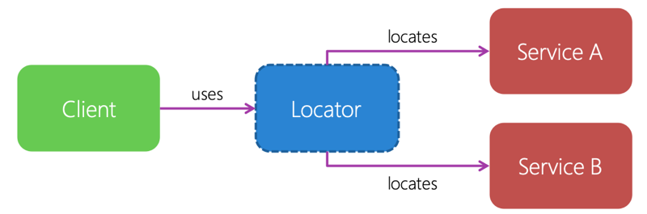

# Use a service locator to register and retrieve dependencies

<hr/>

The second pattern we'll look at is the _service-locator_ pattern. The service-locator pattern invlves a piece of code that maintains a list of known dependencies. Typically, you'll create and register your dependencies in your platform-specific code. When any of your components needs a dependency, it consults the service locator, which then returns the registered instance.



## Service-locator example definition

The implementation of a service locator often involves some kinf of dictionary or hash table that maps the abstraction to the concrete implementation.

Here's an example definitino:

```csharp
public sealed class ServiceLocator
{
    public static ServiceLocator Instance { get; set; }

    public void Add(Type contractType, object value);
    public void Add(Type contractType, Type serviceType);
    public object Resolve(Type contractType);
    public T Resolve<T>();
}
```

## The singleton pattern

The _singleton pattern_ lets you create an object with increased reponsibility, Normally an object is resposible for doing its own work on its own properties. But some objects have increased reponsibility and other objects that rely on them. Objects that have more responsibility will take on a spacific role. As result, you normally want only one of these objects per type instantiated. The singleton patterin allows you to make sure there's only one object of a specific type at any time.

When you design your singleton class, clients can't directly instantiate the clas. To create a singleton class, you first create a private class constructor. Then you allow clients to request an instance of the object through a static property.

## Registering a dependency with the service locator

The concrete implementations of your abstractions will be platform-specific code. You'll add the implementation the service locator by registering the abstraction with the implementation's type in the dictionary.

```csharp
public partial class AppDelegate
{
   ...
    public override void FinishedLaunching(UIApplication application)
    {
        ...
        ServiceLocator.Instance.Add<IMessageDialog,MessageDialog_iOS>();
    }
}
```

## Using the service locator

To use the locator, you use the service locator's singleton property and request the abstraction. In this cas, the abstraction is the `IMessageDialog` interface. Let's assume each platform-specific project has registered an implementation of that interface with the same service locator.

```csharp
public void ShowMessage(string title, string message, string buttonText)
{
    var messageDialog = ServiceLocator.Instance.Resolve<IMessageDialog>();
    if (!messageDialog.ShowMessage("About",
        "Using the Service Locator Pattern to show this message", "Ok"))
    {
        ...
    }
}
```

## Service locator advantages

The service locatior has the following advantages:

- The service-locator pattern is easy to use and understand. You can't need to understand how the service locator works internally to use it. You register dependencies and request dependencies as needed.
- You client code can just-in-time request services. You decide when you want the dependency instantiated, and you request the instance as needed.
- You can use the service-locator pattern with any client.

## Service locator disadvantages

The serice locator has the following disadvantages:

- Clients must all have access to the service locator. This fact is considered a primary disadvantage of the service-locator pattern. The service locator is a globale dependency that all your code needs access to.
- The service-locator pattern is sometimes seen as a bad programming practice because it makes these tasks difficlult:

  - Identify dependencies in code
  - Detect missing dependencies before runtime.

But the pattern has specific use cases that make it invaluable. Inversion of controll(IoC) containers is one of these use cases. You'll explore IoC containers later in this module.

<hr/>

Get more information at [here](https://docs.microsoft.com/en-us/learn/modules/explore-cross-platform-design-patterns/8-use-a-service-locator-to-register-and-retrieve-dependencies).
