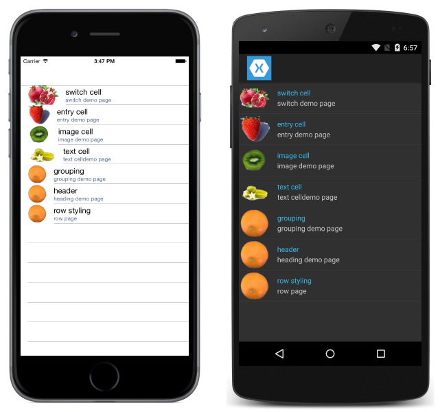
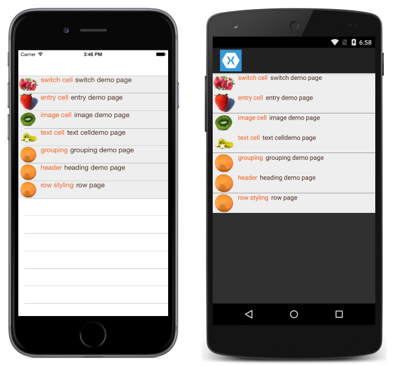

# Cusomizing ListView Cell Appearence

<hr/>

[`ListView`](https://docs.microsoft.com/en-us/dotnet/api/xamarin.forms.listview) presents scrollable lists, which can be customized through the use of `ViewCells`. `ViewCells` can be used for displaying text and images, indicating a true/false state and receiving user input.

## Built in Cells

Xamarin.Forms comes with built-in cells that work for many simple applications:

- **TextCell** - for displaying text
- **ImageCell** - for displaying an image with text.

Two additional cells, [`SwitchCell`](https://docs.microsoft.com/en-us/xamarin/xamarin-forms/user-interface/tableview#switchcell)
and [`EntryCell`](https://docs.microsoft.com/en-us/xamarin/xamarin-forms/user-interface/tableview#entrycell) are available, however they aren't commonly used with `ListView`. See [`TableView`](https://docs.microsoft.com/en-us/xamarin/xamarin-forms/user-interface/tableview) for more information about these cells.

### TextCell

TextCells are rendered as natice controls at runtime, so performace is very good compared to a custom `ViewCell`. TextCells are cusomizable, allowing you to set:

- `Text` : the text that shown on the first line, in large font.
- `Detail`: the text is shown underneath the first line, in a smaller font.
- `TextColor`: the color of the text.
- `DetailColor`: the color of the detail text.


### ImageCell

`ImageCell` is usedful when you need to display a list of data with a visual aspect, such as a list of contacts or movies. ImageCells are customizable, allowing you to set:

- `Text`: the text that is shown on the firt line, in large font.
- `Detail`: the text that is shown underneath the first line, in a smaller font.
- `TextColor`: the color of the text.
- `DetailColor`: the color of the detail text
- `ImageSource`: the image to display next to the text.



### Custom Cells

When the built-in cells don't provide the required layout, custom cells implemented the required layout. Build a cell with two lables that have equal weight. A `TextCell` would be insufficient because the `TextCell` has one label that is smaller.
All custom cells must derive from [`ViewCell`](https://docs.microsoft.com/en-us/dotnet/api/xamarin.forms.viewcell), the same base class that all of the built-inn cell types use.



**XAML**

The XAML to create the above layout is below:

```xaml
<?xml version="1.0" encoding="UTF-8"?>
<ContentPage xmlns="http://xamarin.com/schemas/2014/forms"
xmlns:x="http://schemas.microsoft.com/winfx/2009/xaml"
x:Class="demoListView.ImageCellPage">
    <ContentPage.Content>
        <ListView  x:Name="listView">
            <ListView.ItemTemplate>
                <DataTemplate>
                    <ViewCell>
                        <StackLayout BackgroundColor="#eee"
                        Orientation="Vertical">
                            <StackLayout Orientation="Horizontal">
                                <Image Source="{Binding image}" />
                                <Label Text="{Binding title}"
                                TextColor="#f35e20" />
                                <Label Text="{Binding subtitle}"
                                HorizontalOptions="EndAndExpand"
                                TextColor="#503026" />
                            </StackLayout>
                        </StackLayout>
                    </ViewCell>
                </DataTemplate>
            </ListView.ItemTemplate>
        </ListView>
    </ContentPage.Content>
</ContentPage>
```

The XAML above is doing a lot. Let's break it down:

- The custom cell is nested inside a `DataTemplate`, which is inside `ListView.ItemTemplate`.
- `ViewCell` is the type of the custom cell. The child of the DataTemplate element must be of or derive from type `ViewCell`.
- Notice that inside the `ViewCell`, layout is managed by a `StackLayout`. This layout allows us to customize the backgtound color. Note that any property of `StackLayout` that bindable can be bound inside a custom cell, although that is not shown here.
- Inside the `ViewCell`, layout can be managed by any Xamarin.Forms layout.

**C#**

Specifying a custom cell in C# is a bit more verbose than the XAML equivalent. Let's take a look:

First, define a custom cell class, with `ViewCell` as the base class:

```Csharp
public class CustomCell : ViewCell
    {
        public CustomCell()
        {
            //instantiate each of our views
            var image = new Image ();
            StackLayout cellWrapper = new StackLayout ();
            StackLayout horizontalLayout = new StackLayout ();
            Label left = new Label ();
            Label right = new Label ();

            //set bindings
            left.SetBinding (Label.TextProperty, "title");
            right.SetBinding (Label.TextProperty, "subtitle");
            image.SetBinding (Image.SourceProperty, "image");

            //Set properties for desired design
            cellWrapper.BackgroundColor = Color.FromHex ("#eee");
            horizontalLayout.Orientation = StackOrientation.Horizontal;
            right.HorizontalOptions = LayoutOptions.EndAndExpand;
            left.TextColor = Color.FromHex ("#f35e20");
            right.TextColor = Color.FromHex ("503026");

            //add views to the view hierarchy
            horizontalLayout.Children.Add (image);
            horizontalLayout.Children.Add (left);
            horizontalLayout.Children.Add (right);
            cellWrapper.Children.Add (horizontalLayout);
            View = cellWrapper;
        }
    }
```

In your constructor for the page with the `ListView`, set the ListView's `ItemTemplate` property to a new `DataTemplate`.

```Csharp
public partial class ImageCellPage : ContentPage
    {
        public ImageCellPage ()
        {
            InitializeComponent ();
            listView.ItemTemplate = new DataTemplate (typeof(CustomCell));
        }
    }
```

Note that the constructor for DataTemplate takes a type. The typeof operator gets the CLR type for `CustomCell`.

**Binding Context Changes**

When binding to a custom cell type's [`BindableProperty`](https://docs.microsoft.com/en-us/dotnet/api/xamarin.forms.bindableproperty) instances, the UI controls displaying the `BindableProperty` values should use the [`OnBindingContextChanged`](https://docs.microsoft.com/en-us/dotnet/api/xamarin.forms.cell.onbindingcontextchanged#Xamarin_Forms_Cell_OnBindingContextChanged) override to set the data to be displayed in each cell, rather than the cell contructor, as demonstrated in the following code example:

```Csharp
public class CustomCell : ViewCell
{
    Label nameLabel, ageLabel, locationLabel;

    public static readonly BindableProperty NameProperty =
        BindableProperty.Create ("Name", typeof(string), typeof(CustomCell), "Name");
    public static readonly BindableProperty AgeProperty =
        BindableProperty.Create ("Age", typeof(int), typeof(CustomCell), 0);
    public static readonly BindableProperty LocationProperty =
        BindableProperty.Create ("Location", typeof(string), typeof(CustomCell), "Location");

    public string Name {
        get { return(string)GetValue (NameProperty); }
        set { SetValue (NameProperty, value); }
    }

    public int Age {
        get { return(int)GetValue (AgeProperty); }
        set { SetValue (AgeProperty, value); }
    }

    public string Location {
        get { return(string)GetValue (LocationProperty); }
        set { SetValue (LocationProperty, value); }
    }
    ...

    protected override void OnBindingContextChanged ()
    {
        base.OnBindingContextChanged ();

        if (BindingContext != null) {
            nameLabel.Text = Name;
            ageLabel.Text = Age.ToString ();
            locationLabel.Text = Location;
        }
    }
}
```

The [`OnBindingContextChanged`](https://docs.microsoft.com/en-us/dotnet/api/xamarin.forms.cell.onbindingcontextchanged#Xamarin_Forms_Cell_OnBindingContextChanged) override will be called when the [`BindingContextChanged`](https://docs.microsoft.com/en-us/dotnet/api/xamarin.forms.bindableobject.bindingcontextchanged) event fires, in response to the value of the [`BindingContext`](https://docs.microsoft.com/en-us/dotnet/api/xamarin.forms.bindableobject.bindingcontext#Xamarin_Forms_BindableObject_BindingContext) property changing. Therefore when the `BindingContext` changes, the UI controls displaying the [`BindableProperty`](https://docs.microsoft.com/en-us/dotnet/api/xamarin.forms.bindableproperty) values should set their data. Note that the `BindingContext` should be checked for a `null` value, as this can be set by Xamarin.Forms for garbage collection, which in turn will result in the `OnbindingContextChanged` override being called.

Alternatively, UI controls can bind to the [`BindableProperty`](https://docs.microsoft.com/en-us/dotnet/api/xamarin.forms.bindableproperty) instances to display their values, which removes the need to override the `OnBindingContextChanged` method.

In XAML, binding the custom cell type to data can be achieved as shown in the following code example:

```xaml
<ListView x:Name="listView">
    <ListView.ItemTemplate>
        <DataTemplate>
            <local:CustomCell Name="{Binding Name}" Age="{Binding Age}" Location="{Binding Location}" />
        </DataTemplate>
    </ListView.ItemTemplate>
</ListView>
```

<hr/>

Get more information at [here](https://docs.microsoft.com/en-us/xamarin/xamarin-forms/user-interface/listview/customizing-cell-appearance).
