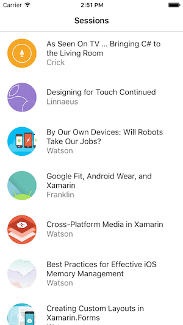

# Data Pages

<hr/>

## Get Started

To get started building a simplw data-driven page using the DataPages Preview, follow the steps below. This demo uses a hardcoded style ("Events") in the Preview builds that only works with the specific JSON format in the code.


1. **Add Nuget Packages**
   Add these Nuget packages to your Xamarin.Forms .NET Standard library and application projects:

   - Xamarin.Forms.Pages
   - Xamarin.Forms.Theme.Base
   - A theme implementation Nuget(eg. Xamarin.Forms.Themes.Light)

2. **Add Theme Reference**
   In the **App.xaml** file, add a custom xmlns:mytheme for the theme and ensure the theme is merged into the application's resource dictionary:

```xaml
<Application xmlns="http://xamarin.com/schemas/2014/forms"
  xmlns:x="http://schemas.microsoft.com/winfx/2009/xaml"
  xmlns:mytheme="clr-namespace:Xamarin.Forms.Themes;assembly=Xamarin.Forms.Theme.Light"
  x:Class="DataPagesDemo.App">
    <Application.Resources>
        <ResourceDictionary MergedWith="mytheme:LightThemeResources" />
    </Application.Resources>
</Application>
```

2. **Add a XAML Page**
   Add a new XAML page to the Xamarin.Forms application, and change the base class form ContentPage to Xamarin.Forms.Pages.ListDataPage. This has to be done in both the C# and the XAML

   **C# file**

```csharp
   public partial class SessionDataPage : Xamarin.Forms.Pages.ListDataPage // was ContentPage
   {
   public SessionDataPage ()
   {
    InitializeComponent ();
   }
   }
```

3. **Add the DataSource**
   Delete the Content element and replace it with `a p:ListDataPage.DataSource` to populate the page with data. In the example below a remote Json data file is being loaded from a URL.
   **Note**: the preview requires a `StyleClass` attribute to provide rendering hints for the data source. The `StyleClass="Events"` refers to a layout that is predefined in the preview and contains styles hardcoded to match the JSON data source being used.

```xaml
   <?xml version="1.0" encoding="UTF-8"?>
   <p:ListDataPage xmlns="http://xamarin.com/schemas/2014/forms"
             xmlns:x="http://schemas.microsoft.com/winfx/2009/xaml"
             xmlns:p="clr-namespace:Xamarin.Forms.Pages;assembly=Xamarin.Forms.Pages"
             x:Class="DataPagesDemo.SessionDataPage"
             Title="Sessions" StyleClass="Events">

    <p:ListDataPage.DataSource>
        <p:JsonDataSource Source="http://demo3143189.mockable.io/sessions" />
    </p:ListDataPage.DataSource>
   </p:ListDataPage>
```

**JSON data**

```json
[
  {
    "end": "2016-04-27T18:00:00Z",
    "start": "2016-04-27T17:15:00Z",
    "abstract": "The new Apple TV has been released, and YOU can be one of the first developers to write apps for it. To make things even better, you can build these apps in C#! This session will introduce the basics of how to create a tvOS app with Xamarin, including: differences between tvOS and iOS APIs, TV user interface best practices, responding to user input, as well as the capabilities and limitations of building apps for a television. Grab some popcorn—this is going to be good!",
    "title": "As Seen On TV … Bringing C# to the Living Room",
    "presenter": "Matthew Soucoup",
    "biography": "Matthew is a Xamarin MVP and Certified Xamarin Developer from Madison, WI. He founded his company Code Mill Technologies and started the Madison Mobile .Net Developers Group.  Matt regularly speaks on .Net and Xamarin development at user groups, code camps and conferences throughout the Midwest. Matt gardens hot peppers, rides bikes, and loves Wisconsin micro-brews and cheese.",
    "image": "http://i.imgur.com/ASj60DP.jpg",
    "avatar": "http://i.imgur.com/ASj60DP.jpg",
    "room": "Crick"
  }
]
```

4. **Run!**
   This works because the pre-built style "Events" exists in the Light Theme Nuget package and has styles defined that match the data source.(eg. "title", "image", "presenter").
   The "Events" `StyleClass` is built to display the `ListDataPage` control with a custom `CardView` control that is defined in Xamarin.Forms.Pages. The `CardView` control has three properties: `ImageSource`, `Text`,`Detail`. The theme is hardcoded to bind the datasource's three fields(from the JSON file) to these properties for display.
5. **Customize**
   The inherite style can be overrideden by specifying a template and using data source bindings. The Xaml below declares a custom template for each row using the new `ListItemControl` and `{p:DataSourceBinding}` syntax which is includeed in the **Xamarin.Forms.Pages** Nuget:

```xaml
<p:ListDataPage.DefaultItemTemplate>
    <DataTemplate>
        <ViewCell>
            <p:ListItemControl
                Title="{p:DataSourceBinding title}"
                Detail="{p:DataSourceBinding room}"
                ImageSource="{p:DataSourceBinding image}"
                DataSource="{Binding Value}"
                HeightRequest="90"
            >
            </p:ListItemControl>
        </ViewCell>
    </DataTemplate>
</p:ListDataPage.DefaultItemTemplate>
```

By providing a DataTemplate this code overrides the `StyleClass` and instead uses the default layout for a `ListItemControl`.



Developers that prefer C# to XAML can create data source bindings too (remember to include a `using Xamarin.Form.Pages;` statement)

```csharp
SetBinding (TitleProperty, new DataSourceBinding ("title"));
```

<hr/>
   More information at [here](https://docs.microsoft.com/en-us/xamarin/xamarin-forms/user-interface/datapages/).
