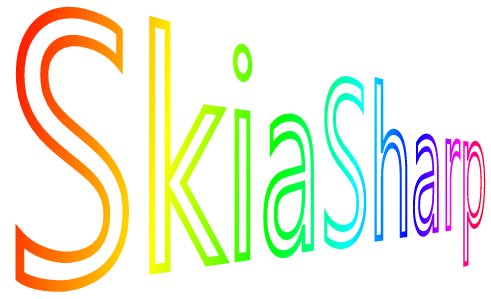
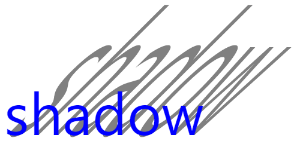

# Deep Dive into SkiaSharp with Xamarin.Forms

<hr/>

Xamarin.Forms is a versatile cross-platform user-interface toolkit that allows a single program to run on iOS, Android, the Universal Windows Platform and ([most recently](https://blog.xamarin.com/preview-bringing-macos-to-xamarin-forms/)) macOS.

How ever, one feature missing from Xamarin.Forms is a graphics system. Sure, Xamarin.Forms can render bitmaps, and you can size and rotate a BoxView for some simple blocky images, but for those of us who love graphics programming, Xamarin.Forms has a big polugon-shaped hole.

But don't fret! A very compelling solution for Xamarin.Forms graphics is SkiaSharp, Xamarin's C# library that incorporates Google's powerfull Skia Graphics Engine.



SkiaShap suports all the basic graphics transforms found in other graphics systems, including translation, scaling, rotation, and skewing, which tilts graphics objects such as this shadow:



That image uses an SKPaint object to define the charactieristics of the text output. For the shadow, the code sets a different colot and a combination of translation, scaling, and skew to enlarge the text and tilt it to one side:

```csharp
using (SKPaint textPaint = new SKPaint())
{
    textPaint.Style = SKPaintStyle.Fill;
    textPaint.TextSize = screenWidth / 6;
    textPaint.IsAntialias = true;

    // Common to shadow and text
    string text = "shadow";
    float xText = 20;
    float yText = screenHeight / 2;

    // Shadow
    textPaint.Color = SKColors.Gray;
    canvas.Save();
    canvas.Translate(xText, yText);
    canvas.Skew((float)Math.Tan(-Math.PI / 4), 0);
    canvas.Scale(1, 3);
    canvas.Translate(-xText, -yText);
    canvas.DrawText(text, xText, yText, textPaint);
    canvas.Restore();

    // Text
    textPaint.Color = SKColors.Blue;
    canvas.DrawText(text, xText, yText, textPaint);
}
```

On mobile platforms and other moderin devices, graphics is often intimately related to touch. Xamarin.Forms supports some rudimentary touch events, but not the essential tool of tracking individual fingers. More sophisticated touch tracking for xamarin.forms is now available with a Xamarin.Forms effect described in [Invoking Events from Effect](https://developer.xamarin.com/guides/xamarin-forms/application-fundamentals/effects/touch-tracking/).

## Wrapping Up

There are still more SkiaSharp articles to come, so check the [Using SkiaSharp in Xamarin.Forms](https://developer.xamarin.com/guides/xamarin-forms/advanced/skiasharp/) page often to see what's new.

Meanwhile, you'll also want to register for [Xamarin University Presents](https://www.xamarin.com/webinars/series/register/xamarin-university-presents), a seris of five must-see webinars in July, including one I'll be doing on SkiaSharp Graphics for Xamarin.Forms.

<hr/>

Get more information at [here](https://devblogs.microsoft.com/xamarin/deep-dive-skiasharp-xamarin-forms/).
