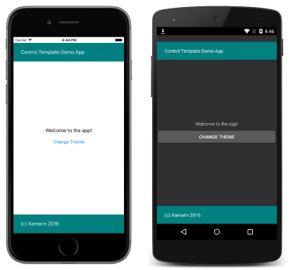

# Xamarin.Forms Control Templates

<hr/>

## Introduction

Xamarin.Forms control templates provide the ability to easily theme and re-theme application pages at runtime. This article provides an introduction to control templates.

Controls have different properties, such as `BackgroundColor` and `TextColor`, that can define aspects of the control's appearance. These properties can be set using [styles](https://docs.microsoft.com/en-us/xamarin/xamarin-forms/user-interface/styles/index), which can be chaned at runtime to implement basic theming. However, styles don't maintain a clean separation between the appearance of a page and its content, and the changes that can be made by setting such properties are limited.

Control templates provide a clean separation between the appearance of a page and its content, therefore enabling the creation of pages that can easily be themed.

## Creating a ControlTemplate

Control templates can be defined at the application level or at the page level. This article demonstrates how to create and consume control templates.

A [`ControlTemplate`](https://docs.microsoft.com/en-us/dotnet/api/xamarin.forms.controltemplate)

specifies the appearence of a page or view, and contains a root layout, and within the layout, the controls that implement the template. Typically, a `ControlTemplate` will utilize a [`ContentPresenter`](https://docs.microsoft.com/en-us/dotnet/api/xamarin.forms.contentpresenter) to mark where the content to be displayed bu the page or view will appear. The page or view that consumes the `ControlTemplate` will then define content to be displayed by the `ContentPredenter`. The following diageam illustrates a `ControlTemplate` for a page that contains a number of controls, including a `ContentPresenter` marked by a blue rectangle:


A [`ControlTemplate`] can be applied to the following types by setting their `ControlTemplate` properties:

- [`ContentPage`](https://docs.microsoft.com/en-us/dotnet/api/xamarin.forms.contentpage)
- [`ContentView`](https://docs.microsoft.com/en-us/dotnet/api/xamarin.forms.contentview)
- [`TemplatedPage`](https://docs.microsoft.com/en-us/dotnet/api/xamarin.forms.templatedpage)
- [`TemplatedView`](https://docs.microsoft.com/en-us/dotnet/api/xamarin.forms.templatedview)

When a [`ControlTemplate`](https://docs.microsoft.com/en-us/dotnet/api/xamarin.forms.controltemplate) is created and assigned to these types, any existing appearance is replaced with the appearance defined in the `ControlTemplate`. in addtion, as well as setting appearance by using the `ControlTemplate` property, control templats can also be applied by using styles to further expand theme ability.

Control templates can be created in XAML and in C#:

- Control templates created in XAML are defined in a [`ResourceDictionary`](https://docs.microsoft.com/en-us/dotnet/api/xamarin.forms.resourcedictionary) that's assigned to the [`Resource`](https://docs.microsoft.com/en-us/dotnet/api/xamarin.forms.visualelement.resources#Xamarin_Forms_VisualElement_Resources) collection of a page, or more typically to the [`Resources`](https://docs.microsoft.com/en-us/dotnet/api/xamarin.forms.application.resources#Xamarin_Forms_Application_Resources) collection of the application.
- Control templates created in C# are typically defined in the page's class, or in a class that can be globally accessed.

Choosing where to define a [`ControlTemplate`](https://docs.microsoft.com/en-us/dotnet/api/xamarin.forms.controltemplate) instance impacts where it can be used:

- [`ControlTemplate`](https://docs.microsoft.com/en-us/dotnet/api/xamarin.forms.controltemplate) instances defined at the page-level can only be applied to the page.
- [`ControlTemplate`](https://docs.microsoft.com/en-us/dotnet/api/xamarin.forms.controltemplate) instances defined at the application-level can be applied to page throughout the application.

### Creating a ControlTemplate in XAML

To define a [`ControlTemplate`](https://docs.microsoft.com/en-us/dotnet/api/xamarin.forms.controltemplate) at the application level, a [`ResourceDictionary`](https://docs.microsoft.com/en-us/dotnet/api/xamarin.forms.resourcedictionary) must be added to the `App` class. By default, all Xamarin.Forms application created from a template use the **App** class to implement the [`Application`](https://docs.microsoft.com/en-us/dotnet/api/xamarin.forms.application) subclass. To declare a `ControlTemplate` at the application level, in the application's `ResourceDictionary` using XAM, the default **App** class must be replaced with a XAML **App** class and associated code-behind, as shown in the following code example:

```xml
<Application xmlns="http://xamarin.com/schemas/2014/forms" xmlns:x="http://schemas.microsoft.com/winfx/2009/xaml" x:Class="SimpleTheme.App">
    <Application.Resources>
        <ResourceDictionary>
            <ControlTemplate x:Key="TealTemplate">
                <Grid>
                    ...
                    <BoxView ... />
                    <Label Text="Control Template Demo App"
                           TextColor="White"
                           VerticalOptions="Center" ... />
                    <ContentPresenter ... />
                    <BoxView Color="Teal" ... />
                    <Label Text="(c) Xamarin 2016"
                           TextColor="White"
                           VerticalOptions="Center" ... />
                </Grid>
            </ControlTemplate>
            <ControlTemplate x:Key="AquaTemplate">
                ...
            </ControlTemplate>
        </ResourceDictionary>
    </Application.Resources>
</Application>
```

Each [`ControlTemplate`](https://docs.microsoft.com/en-us/dotnet/api/xamarin.forms.controltemplate) instance is created as a reusable object in a [`ResourceDictionary`](https://docs.microsoft.com/en-us/dotnet/api/xamarin.forms.resourcedictionary). This ia achieved by giving each declaration a unique `x:Key` attribute, which provides it with a descriptive key in the `ResourceDictionary`.

The following code example shows the associated `App` code-behind:

```csharp
public partial class App : Application
{
  public App ()
  {
    InitializeComponent ();
    MainPage = new HomePage ();
  }
}
```

As well as setting the `MainPage` property, the code-behind must also call the `InitializeComponent` method to load and parse the associated XAML.

The following code example shows a [`ContentPage`](https://docs.microsoft.com/en-us/dotnet/api/xamarin.forms.contentpage) applying the `TealTemplate` to the [`ContentView`](https://docs.microsoft.com/en-us/dotnet/api/xamarin.forms.contentview):

```xml
<ContentPage xmlns="http://xamarin.com/schemas/2014/forms" xmlns:x="http://schemas.microsoft.com/winfx/2009/xaml" x:Class="SimpleTheme.HomePage">
    <ContentView x:Name="contentView" Padding="0,20,0,0"
                 ControlTemplate="{StaticResource TealTemplate}">
        <StackLayout VerticalOptions="CenterAndExpand">
            <Label Text="Welcome to the app!" HorizontalOptions="Center" />
            <Button Text="Change Theme" Clicked="OnButtonClicked" />
        </StackLayout>
    </ContentView>
</ContentPage>
```

The `TealTemplate` is assigned to the [`ContentView.ControlTemplate`](https://docs.microsoft.com/en-us/dotnet/api/xamarin.forms.templatedview.controltemplate#Xamarin_Forms_TemplatedView_ControlTemplate) property by using the `StaticResource` markup extension. The [`ContentView.Content`](https://docs.microsoft.com/en-us/dotnet/api/xamarin.forms.contentview.content#Xamarin_Forms_ContentView_Content) property is set to a [`StackLayout`](https://docs.microsoft.com/en-us/dotnet/api/xamarin.forms.stacklayout) that defines the content to be displayed on the [`ContentPage`](https://docs.microsoft.com/en-us/dotnet/api/xamarin.forms.contentpage). This content will be displayed by the [`ContentPresenter`](https://docs.microsoft.com/en-us/dotnet/api/xamarin.forms.contentpresenter) contained in the `TealTemplate`. This results in the appearance shown in the following screenshots:



#### Re-theming an Application at Runtime

Clicking the **Change Theme** button executes the `OnButtonClicked` method, which is shown in the following code example:

```csharp
void OnButtonClicked (object sender, EventArgs e)
{
  originalTemplate = !originalTemplate;
  contentView.ControlTemplate = (originalTemplate) ? tealTemplate : aquaTemplate;
}
```

## Binding from a ControlTemplate

Template bindings allow controls in a control temlate to data bind to pubic properties, enabling property calues on controls in the conteol template to be easily changed. This
article demonstrates using template bindings to perform data binding from a control template.

A [`TemplateBinding`](https://docs.microsoft.com/en-us/dotnet/api/xamarin.forms.templatebinding) is used to bind a control's property in a control template to a bindable property on the parent of the _target_ view that owns the control template. For example, rather than defining the text displayed by [`Lable`](https://docs.microsoft.com/en-us/dotnet/api/xamarin.forms.label) instances inside the [`ControlTemplate`](https://docs.microsoft.com/en-us/dotnet/api/xamarin.forms.controltemplate), you can use a template binding to bind the [`Label.Text`](https://docs.microsoft.com/en-us/dotnet/api/xamarin.forms.label.text#Xamarin_Forms_Label_Text) property to bindable properties that define the text to be displayed.

Note that using a `TemplateBinding` outside of a [`ControlTemplate`](https://docs.microsoft.com/en-us/dotnet/api/xamarin.forms.controltemplate) is not supported.

### Creating a TemplateBinding in XAML

In XAML, a [`TemplateBinding`](https://docs.microsoft.com/en-us/dotnet/api/xamarin.forms.templatebinding) is created using the [`TemplateBinding`](https://docs.microsoft.com/en-us/dotnet/api/xamarin.forms.xaml.templatebindingextension) markup extension, as demonstrated in the following code example:

```xml
<ControlTemplate x:Key="TealTemplate">
  <Grid>
    ...
    <Label Text="{TemplateBinding Parent.HeaderText}" ... />
    ...
    <Label Text="{TemplateBinding Parent.FooterText}" ... />
  </Grid>
</ControlTemplate>
```

Rather than set the [`Label.Text`](https://docs.microsoft.com/en-us/dotnet/api/xamarin.forms.label.text#Xamarin_Forms_Label_Text) properties to static text, the properties can use template bindings to bind to bindable properties on the parent of the _target_ view that owns the [`ControlTemplate`](https://docs.microsoft.com/en-us/dotnet/api/xamarin.forms.controltemplate). However, not that the template bindings bind to `Parent.HeaderText` and `Parent.FooterText`, rather `HeaderText` and `FooterText`. This is because in this example, the bindable properties are defined on the grandparent of the target view, rather than the paren, as demonstrated in the following code example:

```xml
<ContentPage ...>
    <ContentView ... ControlTemplate="{StaticResource TealTemplate}">
          ...
    </ContentView>
</ContentPage>
```

The template binding uses the [`Parent`](https://docs.microsoft.com/en-us/dotnet/api/xamarin.forms.element.parent#Xamarin_Forms_Element_Parent) property to return the parent element of the `ContentView` instance, which is the [`ContentPage`](https://docs.microsoft.com/en-us/dotnet/api/xamarin.forms.contentpage) instance. Therefore, using a [`TemplateBinding`](https://docs.microsoft.com/en-us/dotnet/api/xamarin.forms.templatebinding) in the [`ControlTemplate`](https://docs.microsoft.com/en-us/dotnet/api/xamarin.forms.controltemplate) to bind to `Parent.HeaderText` and `Parent.FooterText` locates the bindable properties that are defined on the `ContentPage`, as demonstrated in the following code example:

```csharp
public static readonly BindableProperty HeaderTextProperty =
  BindableProperty.Create ("HeaderText", typeof(string), typeof(HomePage), "Control Template Demo App");
public static readonly BindableProperty FooterTextProperty =
  BindableProperty.Create ("FooterText", typeof(string), typeof(HomePage), "(c) Xamarin 2016");

public string HeaderText {
  get { return (string)GetValue (HeaderTextProperty); }
}

public string FooterText {
  get { return (string)GetValue (FooterTextProperty); }
}
```

<hr/>

Get more information at [here](https://docs.microsoft.com/en-us/xamarin/xamarin-forms/app-fundamentals/templates/control-templates/)
