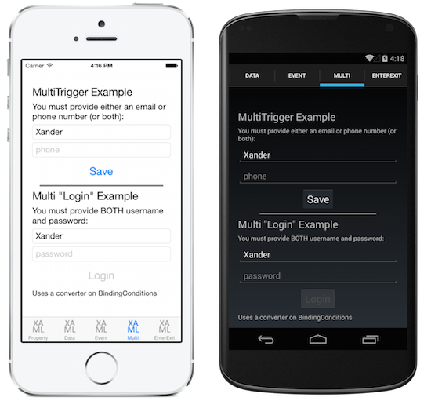

# Xamarin.Forms Trigger

<hr/>

Triggers allow yu to express actionsn declaratively in XAML that change the appearance of controls based on events or property changes.

You can assign a trigger directly to a control, or add it to a page-level or app-level resource dictionary to be appied to multiple controls.

There are four types of trigger:

- [Xamarin.Forms Trigger](#xamarinforms-trigger)
  - [Property Triggers](#property-triggers)
    - [Applying a Trigger using a Style](#applying-a-trigger-using-a-style)
  - [Data Triggers](#data-triggers)
  - [Event Triggers](#event-triggers)
  - [Multi Triggers](#multi-triggers)
    - [Building a "require all" multi trigger](#building-a-%22require-all%22-multi-trigger)
  - [EnterActions and ExitActions](#enteractions-and-exitactions)

<hr>

## Property Triggers

A simple trigger can be expresses purely in XAML, adding a `Trigger` element to control's trigger collection. This example shows a trigger that changes an `Entry` background color whenit receives forcus:

```xml
<Entry Placeholder="enter name">
    <Entry.Triggers>
        <Trigger TargetType="Entry"
             Property="IsFocused" Value="True">
            <Setter Property="BackgroundColor" Value="Yellow" />
        </Trigger>
    </Entry.Triggers>
</Entry>
```

The import parts of the trigger's declaration are:

- **TargetType** - the control type that th trigger applies to.
- **Property** - the property on the control that is monitored.
- **Value** - the value, when it occurs for the monitored property, that causes the trigger to activate.
- **Setter** - a collection of `Setter` elements cab be added and when the trigger condition is met. You must specify the `Property` and `Value` to set.
- **ExterActions and ExitAction (not shown)** - are written in code and can be used addition to (or instead of) `Setter` elements. They are [described blow]().

### Applying a Trigger using a Style

Triggers can also be added to a `Style` declaration on a control, in a page, pr an applocation `ResourceDictionary`. This example declares an implicit style (ie. no `Key` is set) which means it will apply to all `Entry` controls on the page.

```xml
<ContentPage.Resources>
    <ResourceDictionary>
        <Style TargetType="Entry">
                        <Style.Triggers>
                <Trigger TargetType="Entry"
                         Property="IsFocused" Value="True">
                    <Setter Property="BackgroundColor" Value="Yellow" />
                </Trigger>
            </Style.Triggers>
        </Style>
    </ResourceDictionary>
</ContentPage.Resources>
```

<hr/>

## Data Triggers

Data triggers use data binding to monitor another to cause the Setters to get called. Instead of the Property attribute in property trigger, set the Binding attribute to monitoe for the specified value.

The example below uses the data binding syntax `{Binding Source={x:Reference entry}, Path=Text.length}` which is how we refer to another control's properties. When the length of the `entry` is zero, the trigger is activated. In this sample the trigger disables the button whrn the input is empty.

```xml
<!-- the x:Name is referenced below in DataTrigger-->
<!-- tip: make sure to set the Text="" (or some other default) -->
<Entry x:Name="entry"
       Text=""
       Placeholder="required field" />

<Button x:Name="button" Text="Save"
        FontSize="Large"
        HorizontalOptions="Center">
    <Button.Triggers>
        <DataTrigger TargetType="Button"
                     Binding="{Binding Source={x:Reference entry},
                                       Path=Text.Length}"
                     Value="0">
            <Setter Property="IsEnabled" Value="False" />
        </DataTrigger>
    </Button.Triggers>
</Button>
```

Tip: when avaluating `Path=Text.Lenth` always provide a default value for the target property (eg. `Text=""` because otherwise it will be null and the trigger won't work like you expect.)

In addition to specifying `Setter`s you can also provide [`EnterActions`](https://docs.microsoft.com/en-us/xamarin/xamarin-forms/app-fundamentals/triggers#enterexit) and [`ExitActions`](https://docs.microsoft.com/en-us/xamarin/xamarin-forms/app-fundamentals/triggers#enterexit)

<hr/>

## Event Triggers

The `EventTrigger` element requires only an `Entry` property, such as `"Clicked"` ing the example below.

```xml
<EventTrigger Event="Clicked">
    <local:NumericValidationTriggerAction />
</EventTrigger>
```

Notice that there no `Setter` elements but rather a reference to a class defined by `local:NumbericValidationTriggerAction` which requires the `xmlns:local` to be declared in the page's XAML:

```xml
<ContentPage xmlns="http://xamarin.com/schemas/2014/forms"
             xmlns:x="http://schemas.microsoft.com/winfx/2009/xaml"
             xmlns:local="clr-namespace:WorkingWithTriggers;assembly=WorkingWithTriggers"
```

The class itself implements `TriggerAction` which means it should provide an override for the `Invoke` method that is called whenver the trigger event occurs.

a Trigger action implementation should:

- Implement the generic `TriggerAction<T>` class, with the generic parameter corresponding with the type of control the trigger will be applied to. You can use supperclasses such as `VisualElement` to write trigger actions that work with a variety of controls, or specify a control type like `Entry`.
- Override the `Invoke` method - this is called whenever the trigger criteria are met.
- Optionally expose properties that can be set in the XAML when the trigger is declared (such as `Anchor`, `Scale`, and `Length` in this example).

```csharp
public class NumericValidationTriggerAction : TriggerAction<Entry>
{
    protected override void Invoke (Entry entry)
    {
        double result;
        bool isValid = Double.TryParse (entry.Text, out result);
        entry.TextColor = isValid ? Color.Default : Color.Red;
    }
}
```

The properties exposed by the trigger action can be set in the XAML declaration as follows:

```xml
<EventTrigger Event="TextChanged">
    <local:NumericValidationTriggerAction />
</EventTrigger>
```

Be careful whrn sharing triggers in a `ResourceDictionay`, one instance will be shared among controls so any state that is configured once will apply to them all.

Note that event triggers do not support `Enteractions` and `ExitActions` [decribed below](https://docs.microsoft.com/en-us/xamarin/xamarin-forms/app-fundamentals/triggers#enterexit).

<hr/>

## Multi Triggers

A `MultiTrigger` looks similar to a `Trigger` or `DataTrigger` except there can be more than one condition. All the conditions must be true before the `Setter`s are trigged.

Here's an example of a trigger for a button that binds to two different inputs (`email` and `phone`):

```xml
<MultiTrigger TargetType="Button">
    <MultiTrigger.Conditions>
        <BindingCondition Binding="{Binding Source={x:Reference email},
                                   Path=Text.Length}"
                               Value="0" />
        <BindingCondition Binding="{Binding Source={x:Reference phone},
                                   Path=Text.Length}"
                               Value="0" />
    </MultiTrigger.Conditions>

  <Setter Property="IsEnabled" Value="False" />
    <!-- multiple Setter elements are allowed -->
</MultiTrigger>
```

The `Conditions` collection could also contain `PropertyCondition` elements like this:

```xml
<PropertyCondition Property="Text" Value="OK" />
```

### Building a "require all" multi trigger

The multi trigger only updates its control when all conditions are true. Testing for "all field lengths are zero" (such as a login page where all inputs must be complete) is tricky because you want a condition "where Text.Length >0 " but this can't be expressed in XAML.

This can be done with an `IValueConverter`. The converter code below trnsforms the `Text.Length` binding into a `bool` that indicates whether a field is empty or not:

```csharp
public class MultiTriggerConverter : IValueConverter
{
    public object Convert(object value, Type targetType,
        object parameter, CultureInfo culture)
    {
        if ((int)value > 0) // length > 0 ?
            return true;            // some data has been entered
        else
            return false;            // input is empty
    }

    public object ConvertBack(object value, Type targetType,
        object parameter, CultureInfo culture)
    {
        throw new NotSupportedException ();
    }
}
```

To use this converter in a multi trigger, first add it to the page's resource dictionary (along with a custom `xmls:local` namespace definition):

```csharp
<ResourceDictionary>
   <local:MultiTriggerConverter x:Key="dataHasBeenEntered" />
</ResourceDictionary>
```

The XAML is shown below. Note the following differences from the first multi trigger example:

- The button has `IsEnable="false"` set by default.
- The multi trigger conditions use the converter to turn the `Text.Length` value into a `booleam`.
- When all the conditions are `true`, the setter makes the button's `IsEnabeld` property `true`.

```xml
<Entry x:Name="user" Text="" Placeholder="user name" />

<Entry x:Name="pwd" Text="" Placeholder="password" />

<Button x:Name="loginButton" Text="Login"
        FontSize="Large"
        HorizontalOptions="Center"
        IsEnabled="false">
  <Button.Triggers>
    <MultiTrigger TargetType="Button">
      <MultiTrigger.Conditions>
        <BindingCondition Binding="{Binding Source={x:Reference user},
                              Path=Text.Length,
                              Converter={StaticResource dataHasBeenEntered}}"
                          Value="true" />
        <BindingCondition Binding="{Binding Source={x:Reference pwd},
                              Path=Text.Length,
                              Converter={StaticResource dataHasBeenEntered}}"
                          Value="true" />
      </MultiTrigger.Conditions>
      <Setter Property="IsEnabled" Value="True" />
    </MultiTrigger>
  </Button.Triggers>
</Button>
```

These screenshots show the difference between the two multi trigger examples above. In the top part of the creens, text input in just one `Entry` is enough to enable the **S.ave** button. In the bottom part of the screens, the **Login** button remains inactive until both fields contain data.



<hr/>

## EnterActions and ExitActions

Another way to implement changes when a trigger occurs is by adding `EnterActions` and `ExitActions` collections and specifying `TriggerAction<T>` implementations.

You can provide both `EnterActions` and `ExitActions` as well as `Setter`s in a trigger, but be aware that the `Setter` are called immediately (they do not wait for the `EnterAction` or `ExitAction` to complete). Alternatively you can perform everything in the code and not use `Setter`s at all.

```xml

<Entry Placeholder="enter job title">
    <Entry.Triggers>
        <Trigger TargetType="Entry"
                 Property="Entry.IsFocused" Value="True">
            <Trigger.EnterActions>
                <local:FadeTriggerAction StartsFrom="0"" />
            </Trigger.EnterActions>

            <Trigger.ExitActions>
                <local:FadeTriggerAction StartsFrom="1" />
            </Trigger.ExitActions>
                        <!-- You can use both Enter/Exit and Setter together if required -->
        </Trigger>
    </Entry.Triggers>
</Entry>
```

As alaws, when a class is referenced in XAML you should declare a namespace such as `xmlns:local` as shown here:

```xml
<ContentPage xmlns="http://xamarin.com/schemas/2014/forms"
             xmlns:x="http://schemas.microsoft.com/winfx/2009/xaml"
             xmlns:local="clr-namespace:WorkingWithTriggers;assembly=WorkingWithTriggers"
```

The `FadetriggerAction` code is shown below:

```csharp
public class FadeTriggerAction : TriggerAction<VisualElement>
{
    public FadeTriggerAction() {}

    public int StartsFrom { set; get; }

    protected override void Invoke (VisualElement visual)
    {
            visual.Animate("", new Animation( (d)=>{
                var val = StartsFrom==1 ? d : 1-d;
                visual.BackgroundColor = Color.FromRgb(1, val, 1);

            }),
            length:1000, // milliseconds
            easing: Easing.Linear);
    }
}
```

Note: `EnterActions` and `ExitActions` are ignored on **Envent Triggers**.

<hr/>

Get more information at [here](https://docs.microsoft.com/en-us/xamarin/xamarin-forms/app-fundamentals/triggers)
