# Xamarin.Forms Performance Playground

<hr/>

There are many techniques for increasing the **_performance_** of Xamarin.Forms applications.
(Work in progress)

- Bindings
- CollectionView
- Fast Renderers
- HttpClient
- Images
- IoC
- Layouts
- Shell
- Startup
- Visual
- XAMLC

## Fast Renderers

Fast renderers **_reduce the inflation_** and rendering costs of a Xamarin.Forms control into a single view.

Fast renderers are available for the following controls in Xamarin.Forms on Android:

- Button
- Image
- Label
- Frame

_NOTE_: Xamarin.Forms 4 use the Fast Renders by Default.

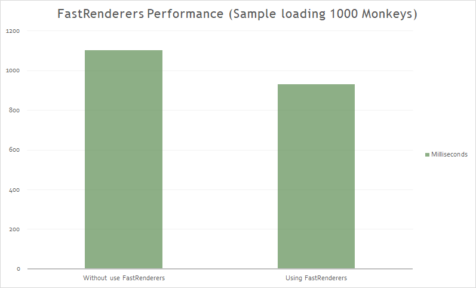

## HttpClient

Many mobile applications depend on external data making intensive use of the network. Therefore, we are interested in having the fastest possible response when making HTTP requests.

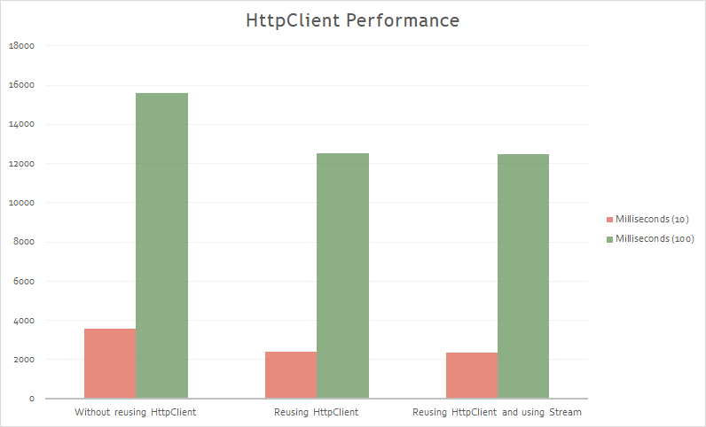

A common mistake working with HttpClient is to download json to a string. The problem is that this creates a string of your entire JSON document needlessly.

- Use GZIP(or deflate) where possible.
- Use Xamarin's Native HttpMessageHandlers.

## Bindings

**_Don't use bindings for content that can be set statically_**.

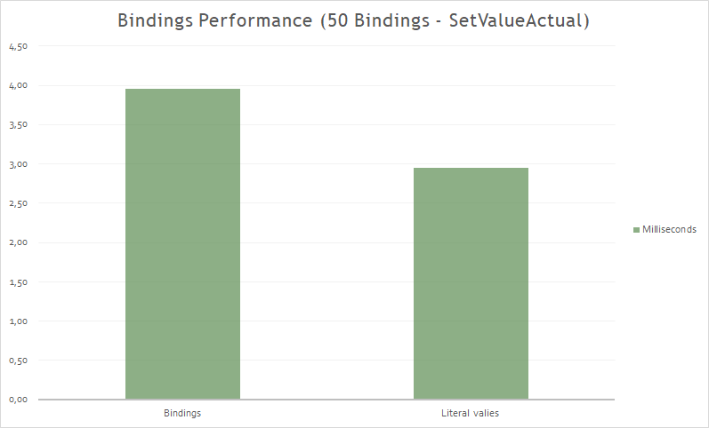

## Images

Displaying image resources cab greatly increase the app's memory footprint.

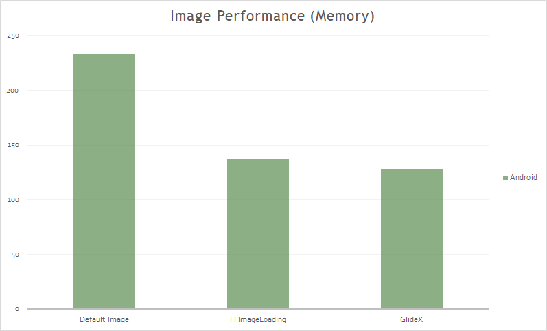

In Xamarin.Forms 4.0 there are improvements related to image management.

## IoC

Comparative performance in the registry and in the dependency resolution of the most used containers when developing with Xamarin.Forms:

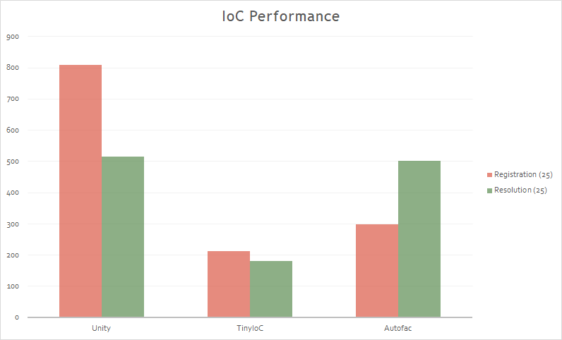

## Layouts

A layout represents a node in the visual tree. A Layout has properties and events that allow to define its behavior. It is responsible for managing the location and size of secondary nodes.

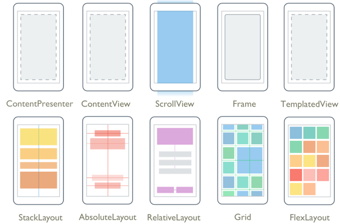

The creation of a Xamarin.Forms layout goes through two phases:

- **_Invalidation_** cycle: The process of recursive notification to the parent node.
- **_Layout_** cycle: After invalideating, we proceed to the reorganization of elements marked as "_invalidated_".

The Invalidation cycle:

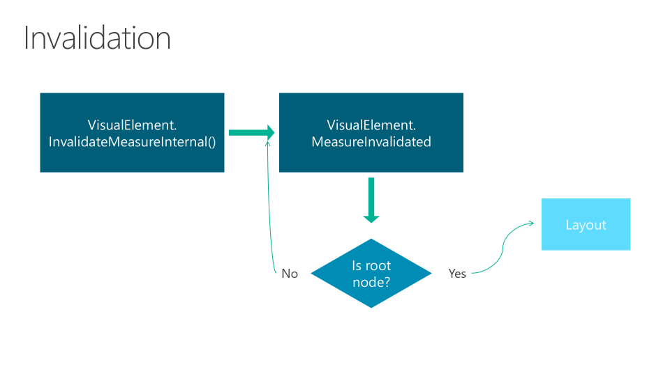

The Layout cycle:

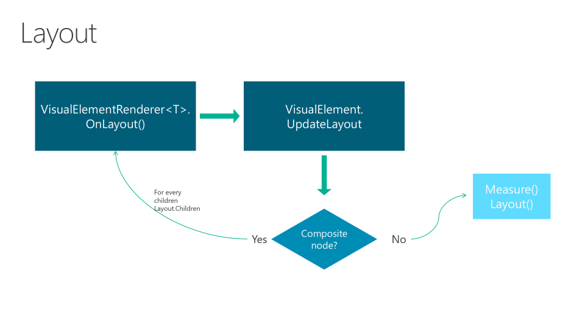

We have the time in miliseconds of **_UpdateChildrenLayout_** in each Layout.

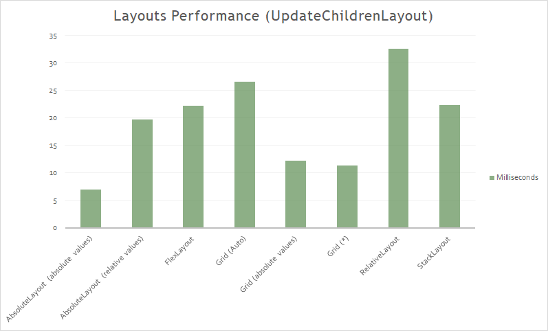

### Grid

The Grid organized child elements into rows and columns. It allows to create complex structures without the need for large nests.

The size of each row and column is important, and affects performance. we must take care of the use of cells and rows.

To consider:

- Using Auto in Column Definition or RowDefinition, the invalidation of one of the children Views causes the chain invalidation of the visual tree of the grid.
- using fixed values in ColumnDefinition or RowDefinition, the Grid ignores any notification of invalidation of its children.
- Using \* in ColumnDefinition or RowDefinition, the Grid ignores any notification of invalidation of the children.

### StackLayout

The StackLayout organizes views in a one-demensional line ("stack"), either horizontally or vertically.

It can lead to excessive nesting

The invalidation of a child View causes the chain invalidation in the visual tree until the StackLayout.

### RelativeLayout

The RelativeLayout organizes the child elements based on relationships between the different elements and the container.
Ideal when the size or positioning should be dynamic and adapt to different conditions.

It is the layout with lowest performance. High CPU consumtion.

### Other Recommendations:

- Do not use StackLayout for just one child.
- Do not use StackLayout when you can use Grid.
- Do not nest serveral StackLayouts when you can use a Grid.
- When using a Grid, try to ensure that as few rows and columns as possible are set to Auto size. Each auto-sized row or column will cause the layout engine to perform additional layout calculations.
- When using an AbsoluteLayout, avoid using the AbsoluteLayout.AutoSize property whenever possible.
- The RelativeLayout gives many possibilites but its performance is worse than the FlexLayout.

## Startup

JIT, AOT and other concepts have an impact on the startup time of the App.

Ahead of Time Compilation builds everything upfront, to avoid JIT when first running your app. When this option is enabled, JIT startup overhead is minimized by precompiling assemblies before runtime, The resulting native code is included in the APK along with the uncompiled assemblies. This results in shorter application startup time, but at the expense of slightly larger APK sizes.

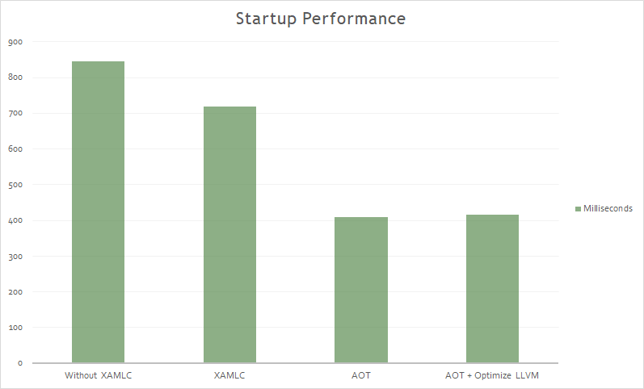

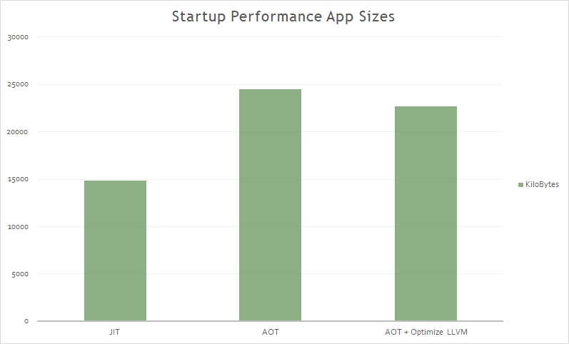

## Visual

Material Design is an opinionated design system created by Google, that precribes the size, color, spacing, and other aspects of how views and layouts should look and behave.

Xamarin.Forms Material Visual can be usd to apply Material Design rules to Xamarin.Forms applications, creating applications that look identical, or largely identical, on iOS and Android. When Material Visual is enabled, supported views adopt the same design cross-platform, creating a unified look and feel. This is achieved with material renderers, that apply the Material Design rules.

Material renderers are currently included in the [Xamarin.Forms.Visual.Material](https://www.nuget.org/packages/Xamarin.Forms.Visual.Material/) NuGet package for the following views:

- Button
- Entry
- Frame
- ProgressBar
- DatePicker
- TimePicker
- Picker
- AcivityIndicator
- Editor
- Slider
- Stepper

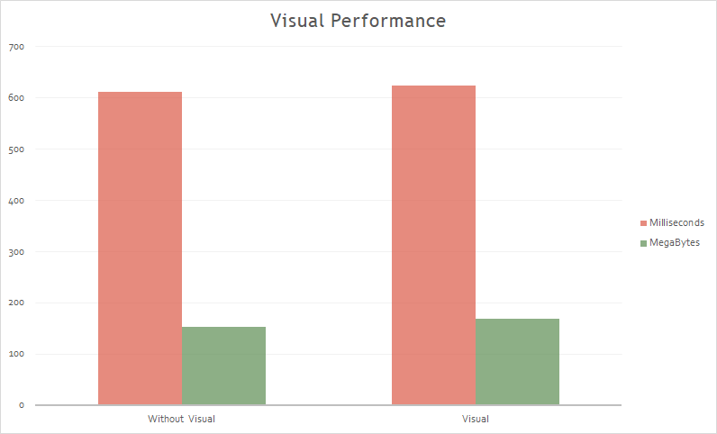
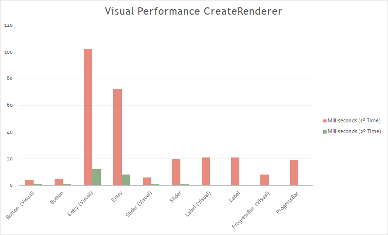

All current Visual renderers with Material use the **_Fast Renderers_** model. This makes most Material renderers faster than the default ones. In this case of the Entry, in Maerial have more layers, animations, etc. It is the only case that gets worse(for now).

The Visual performance tests have been made with:

- Release Mode, AOT, XAMLC(for startup times).
- Average of 5 times.
- Physical device(Oneplus 6).

## XAMLC

XAML can be optionally compiled directly into intermediate language(IL) with the XAML compiler(XAMLC).

XAML compilation offers a number of a benefits:

- It performs comple-time checking of XAML, notify the user of any errors.
- It removes some of the load and instantiation time for XAML elements.
- It helps to reduce the file size of the final assembly by no longer including .xaml files.

```csharp
[assembly: XamlCompilation (XamlCompilationOptions.Compile)]
```

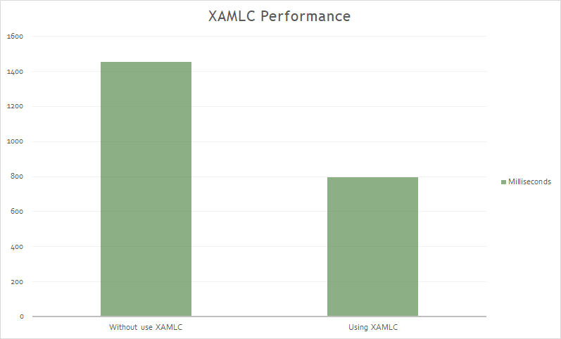

<hr/>

Get more information at [here](https://github.com/jsuarezruiz/xamarin-forms-perf-playground).
