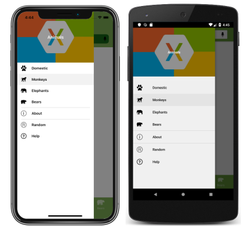
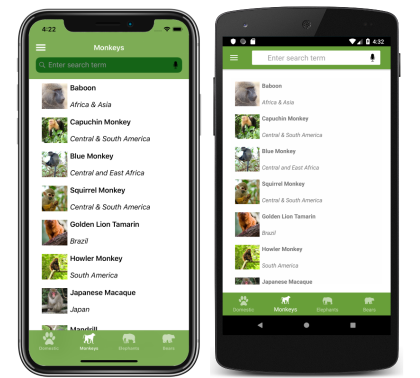
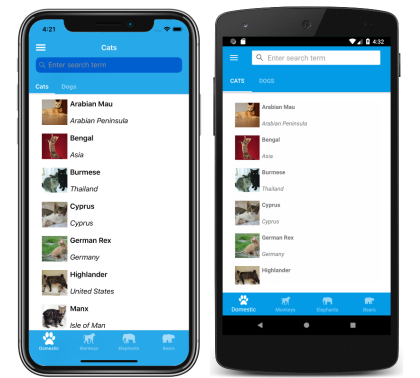
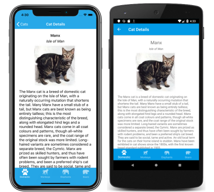

# Xamarin.Forms Shell

## Overview

Xamarin.Forms Shell reduces the complexity of mobile application development by providing the fundamental features that most mobile application require, including:

- A single place to describe the visual hierarchy of an application.
- A common navigation user experience
- A URI-based navigation scheme that permits navigation to any page in the application.
- An integrated search handler.

In addition,Shell applications benefit from an increased rendering speed, and reduced memory consumption.

## Shell navigation experience

Shell provides an opinionated navigation experience, based on flyouts and tabs. The top level of navigation in a Shell application is either a flyout or a bottom tab bar, depending on the navigation requirements of the application.

Selecting a flyout item results in the bottom tab that represents the item being selected and displayed:

Note: when the flyour isn't open the bottom tab bar can be considered to be the top level of navigation in the application.

Each tab displays a [ContentPage](https://docs.microsoft.com/dotnet/api/xamarin.forms.contentpage). However, if a bottom tab contains more than one page, the pages are navigable by the top tab bar:

Within each tab, additional [ContentPage](https://docs.microsoft.com/dotnet/api/xamarin.forms.contentpage) objects can be navigated to:

Get more information at [here](https://docs.microsoft.com/en-us/xamarin/xamarin-forms/app-fundamentals/shell/introduction).
