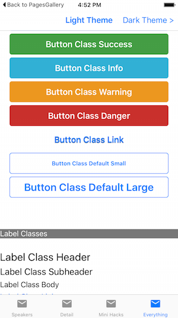

# Xamarin.Forms Themes

<hr/>

## StyleClass

The StypeClass property allows a view's appearance to be changed according to a definition provided by a theme.

The Light and Dark themes both define three different appearances for a BoxView: horizontalRul, Circel, and Rounded. This markup show three different BoxViews with different style classes applied:

```xaml
<StackLayout Padding="40">
    <BoxView StyleClass="HorizontalRule" />
    <BoxView StyleClass="Circle" />
    <BoxView StyleClass="Rounded" />
</StackLayout>
```

## Built-in Classes

In addition to automatically styling the common controls the light and dark themes currently support the following classes that can be applied by setting the StyleClass on these controls.

### BoxView

- HorizontalRule
- Circle
- Rounded

### Image

- Circle
- Rounded
- Thumbnail

### Button

- Default
- Primary
- Success
- Info
- Warning
- Danger
- Link
- Small
- Large

### Label

- Header
- Subheader
- Body
- Link
- Inverse

## Troubleshooting

**Could not load file or assembly 'Xamarin.Form.Theme.Light' or one of it;s dependencies**
In the preview release, themes may not be able to load at runtime. Add the code shown below into the relevant project to fix this error.

**iOS**
In the **AppDelegate.cs** add the following lines after LoadApplication

```csharp
var x = typeof(Xamarin.Forms.Themes.DarkThemeResources);
x = typeof(Xamarin.Forms.Themes.LightThemeResources);
x = typeof(Xamarin.Forms.Themes.iOS.UnderlineEffect);
```

**Android**
In the **MainActivity.cs** add the following lines after LoadApplication

```csharp
var x = typeof(Xamarin.Forms.Themes.DarkThemeResources);
x = typeof(Xamarin.Forms.Themes.LightThemeResources);
x = typeof(Xamarin.Forms.Themes.Android.UnderlineEffect);
```

<hr/>

## Xamarin.Forms Light Theme

1. Add Nuget packages

- Xamarin.Forms.Theme.Base
- Xamarin.Forms.Theme.Light

2. Add to the Resource Dictionary

In the App.xaml file add a new custom xmlns for the theme, and then ensure the theme's resources are merged with the application's resource dictionary. An example XAML file is shown below:

```xaml
<?xml version="1.0" encoding="utf-8"?>
<Application xmlns="http://xamarin.com/schemas/2014/forms" xmlns:x="http://schemas.microsoft.com/winfx/2009/xaml" x:Class="EvolveApp.App"
             xmlns:light="clr-namespace:Xamarin.Forms.Themes;assembly=Xamarin.Forms.Theme.Light">
    <Application.Resources>
        <ResourceDictionary MergedWith="light:LightThemeResources" />
    </Application.Resources>
</Application>

```

3. Load theme classes

Follow troubleshooting step.

4. Use StyleClass
   

```xaml
<StackLayout Padding="20">
    <Button Text="Button Default" />
    <Button Text="Button Class Default" StyleClass="Default" />
    <Button Text="Button Class Primary" StyleClass="Primary" />
    <Button Text="Button Class Success" StyleClass="Success" />
    <Button Text="Button Class Info" StyleClass="Info" />
    <Button Text="Button Class Warning" StyleClass="Warning" />
    <Button Text="Button Class Danger" StyleClass="Danger" />
    <Button Text="Button Class Link" StyleClass="Link" />
    <Button Text="Button Class Default Small" StyleClass="Small" />
    <Button Text="Button Class Default Large" StyleClass="Large" />
</StackLayout>
```

<hr/>

## Creating a Custom Xamarin.Forms Theme

Note the Class attribute for Style (as opposed to the x:Key attribute available in earlier version of Xamarin.Forms)

```xml
<ResourceDictionary>
  <!-- DEFINE ANY CONSTANTS -->
  <Color x:Key="SeparatorLineColor">#CCCCCC</Color>
  <Color x:Key="iOSDefaultTintColor">#007aff</Color>
  <Color x:Key="AndroidDefaultAccentColorColor">#1FAECE</Color>
  <OnPlatform x:TypeArguments="Color" x:Key="AccentColor">
    <On Platform="iOS" Value="{StaticResource iOSDefaultTintColor}" />
    <On Platform="Android" Value="{StaticResource AndroidDefaultAccentColorColor}" />
  </OnPlatform>
  <!--  BOXVIEW CLASSES -->
  <Style TargetType="BoxView" Class="HorizontalRule">
    <Setter Property="BackgroundColor" Value="{ StaticResource SeparatorLineColor }" />
    <Setter Property="HeightRequest" Value="1" />
  </Style>

  <Style TargetType="BoxView" Class="Circle">
    <Setter Property="BackgroundColor" Value="{ StaticResource AccentColor }" />
    <Setter Property="WidthRequest" Value="34"/>
    <Setter Property="HeightRequest" Value="34"/>
    <Setter Property="HorizontalOptions" Value="Start" />

    <Setter Property="local:ThemeEffects.Circle" Value="True" />
  </Style>

  <Style TargetType="BoxView" Class="Rounded">
    <Setter Property="BackgroundColor" Value="{ StaticResource AccentColor }" />
    <Setter Property="HorizontalOptions" Value="Start" />
    <Setter Property="BackgroundColor" Value="{ StaticResource AccentColor }" />

    <Setter Property="local:ThemeEffects.CornerRadius" Value="4" />
  </Style>
</ResourceDictionary>
```

You'll notice that the Rounded class refers to a custom effext CornerRadius. The code for this effect is given below - to reference it correctly a custom xmlns must be added to the App.xaml's root element:

```csharp
xmlns:local="clr-namespace:ThemesDemo;assembly=ThemesDemo"
```

### C# code in the .NET Standard library project or Shared Project

The code for creating a round-corner BoxView use effects. The corner radius is applied using a BindableProperty and is implemented by applying an effect. The effect requires platform-specific code in the iOS and Android projects(shown below).

```csharp
namespace ThemesDemo
{
  public static class ThemeEffects
  {
  public static readonly BindableProperty CornerRadiusProperty =
    BindableProperty.CreateAttached("CornerRadius", typeof(double), typeof(ThemeEffects), 0.0, propertyChanged: OnChanged<CornerRadiusEffect, double>);
    private static void OnChanged<TEffect, TProp>(BindableObject bindable, object oldValue, object newValue)
              where TEffect : Effect, new()
    {
        if (!(bindable is View view))
        {
            return;
        }

        if (EqualityComparer<TProp>.Equals(newValue, default(TProp)))
        {
            var toRemove = view.Effects.FirstOrDefault(e => e is TEffect);
            if (toRemove != null)
            {
                view.Effects.Remove(toRemove);
            }
        }
        else
        {
            view.Effects.Add(new TEffect());
        }

    }
    public static void SetCornerRadius(BindableObject view, double radius)
    {
        view.SetValue(CornerRadiusProperty, radius);
    }

    public static double GetCornerRadius(BindableObject view)
    {
        return (double)view.GetValue(CornerRadiusProperty);
    }

    private class CornerRadiusEffect : RoutingEffect
    {
        public CornerRadiusEffect()
            : base("Xamarin.CornerRadiusEffect")
        {
        }
    }
  }
}
```

### C# code in the iOS project

```csharp
using System;
using Xamarin.Forms;
using Xamarin.Forms.Platform.iOS;
using CoreGraphics;
using Foundation;
using XFThemes;

namespace ThemesDemo.iOS
{
    public class CornerRadiusEffect : PlatformEffect
    {
        private nfloat _originalRadius;

        protected override void OnAttached()
        {
            if (Container != null)
            {
                _originalRadius = Container.Layer.CornerRadius;
                Container.ClipsToBounds = true;

                UpdateCorner();
            }
        }

        protected override void OnDetached()
        {
            if (Container != null)
            {
                Container.Layer.CornerRadius = _originalRadius;
                Container.ClipsToBounds = false;
            }
        }

        protected override void OnElementPropertyChanged(System.ComponentModel.PropertyChangedEventArgs args)
        {
            base.OnElementPropertyChanged(args);

            if (args.PropertyName == ThemeEffects.CornerRadiusProperty.PropertyName)
            {
                UpdateCorner();
            }
        }

        private void UpdateCorner()
        {
            Container.Layer.CornerRadius = (nfloat)ThemeEffects.GetCornerRadius(Element);
        }
    }
}
```

### C# code in the Android project

```csharp
using System;
using Xamarin.Forms.Platform;
using Xamarin.Forms.Platform.Android;
using Android.Views;
using Android.Graphics;

namespace ThemesDemo.Droid
{
    public class CornerRadiusEffect : BaseEffect
    {
        private ViewOutlineProvider _originalProvider;

        protected override bool CanBeApplied()
        {
            return Container != null && Android.OS.Build.VERSION.SdkInt >= Android.OS.BuildVersionCodes.Lollipop;
        }

        protected override void OnAttachedInternal()
        {
            _originalProvider = Container.OutlineProvider;
            Container.OutlineProvider = new CornerRadiusOutlineProvider(Element);
            Container.ClipToOutline = true;
        }

        protected override void OnDetachedInternal()
        {
            Container.OutlineProvider = _originalProvider;
            Container.ClipToOutline = false;
        }

        protected override void OnElementPropertyChanged(System.ComponentModel.PropertyChangedEventArgs args)
        {
            base.OnElementPropertyChanged(args);

            if (!Attached)
            {
                return;
            }

            if (args.PropertyName == ThemeEffects.CornerRadiusProperty.PropertyName)
            {
                Container.Invalidate();
            }
        }

        private class CornerRadiusOutlineProvider : ViewOutlineProvider
        {
            private Xamarin.Forms.Element _element;

            public CornerRadiusOutlineProvider(Xamarin.Forms.Element element)
            {
                _element = element;
            }

            public override void GetOutline(Android.Views.View view, Outline outline)
            {
                var pixels =
                    (float)ThemeEffects.GetCornerRadius(_element) *
                    view.Resources.DisplayMetrics.Density;

                outline.SetRoundRect(new Rect(0, 0, view.Width, view.Height), (int)pixels);
            }
        }
    }
}
```

## Summary

A custom theme can be created by defining styles for each control that requires custom appearance. Multiple styles for a control should be distinguished by different Class attributes in the resource dictionary, and then applied the StyleClass attribute on the control.

<hr/>

Get more information at [here](https://docs.microsoft.com/en-us/xamarin/xamarin-forms/user-interface/themes/index).
