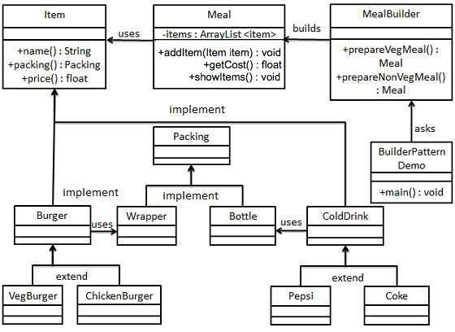

# Design Pattern

## Desgin Patter - Abstract Factory Pattern

Abstract Factory patterns work around a super-factory which creates other factories. This factory is also called as factory of factories. This type of design pattern omes under creational pattern as this pattern provides one of the best ways to create an object.

In Abstract Factory pattern an interface is responsible for creating a factory of related objects without explicitly specifying their classes. Each generated factory can give the objects as per the Factory pattern.

### Implementation

We are going to create a *Shape* and *Color* interfaces and concrete classes implementing these interfaces. We create an abstract factory class *AbstractFactory*  as next step. Factory classes *ShapeFactory* and *ColorFactory* are defined where each factory extends *AbstractFactory*. A factory creator/generator class *FactoryProducer* is created.

## Singleton Pattern

This pattern involves a single class which is responsible to create an object while making sure that only single object gets created. This class provides a way to access its only object which can be accessed directly without need to instantiate the object of the class.

### Implementation Singleton

We're going to create a SingleObject class. SingleObject class have its constructor as private and have a static instance of itself.

## Builder Pattern

Builder pattern builds a complex object using simple objects and using a step by step approach. This type of design pattern comes under creational pattern as this pattern provides one of the best ways to create an object.

A Builder class builds the final object step by step. This builder is independent of other objects.

We have considered a business case of fast-food restaurant where a typical meal could be a burger and a cold drink. Burger could be either a Veg Burger or Chicken Burger and will be packed by a wrapper. Cold drink could be either a coke or pepsi and will be packed in a bottle.

Get more information at [here](https://www.tutorialspoint.com/design_pattern/abstract_factory_pattern.htm).