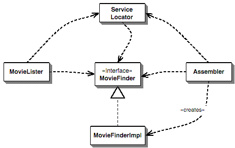

# Inversion of Control Containers and the Dependency Injection pattern

## Components and Services

The topic of wiring elements together drags me almost immediately into the knotty terminology problems  that surround the terms service and component. You find long and contradictory articles on the definition of these things with ease. For my purposes here are my current uses of these overloaded terms.

I use component to mean a glob of software that's intended to be used, without change, by an application that is out of the control of the writers of the component. By 'without change' I mean that the using application doesn't change the source code of the components, although they may alter the components's behavior by extending it in ways allowed by the component writers.

A service is similar to a component in that it's used by foreign applications. The main difference is that I expect a component to be usedlocally(think jar file, assembly, dll, or a source import). A service will be used remotely through some remote interface, either synchronous or asynchronous (eg web service, messaging system, RPC, or socket.)

## Forms of Dependency Injection

The basic idea of the Dependency Injection is to have a separate object, an assembler, that populates a field in the lister class with an appropriate implementation for the finder interface.

There are three main styles of dependency injection. The names I'm using for them Constructor Injection, Setter Injection and Interface Injection. If you read about this stuff in the current discussions about Inversion of Control you'll hear these referred to as type 1 IoC(Interface injection), type 2 IoC (setter injection) and type 3 IoC(Constructor injection). I find numeric names rather hard to remember, which is why I've used the names I have here.

## Using a Service Locator

The key benefit of a Dependency Injector is that it removes the dependency that the MovieLister class has on the concrete MoviFinder implementation. This allows me to give listers to friends and for them to plig in a suitatble implementation for their own environment. Injection isn't the only way to break this dependency, another is to use a service locator.

The basice idea behind a service locator is to have an object that knows how to get hold of all of the services that an application might need. So a service locator for this application would have a method that returns a movie finder when one is needed. Of course this just shifts the burden a tad, we still have to get the locator into the lister, resulting in the dependencies.

## Using a Segregated Interface for the Locator

One of the issues with the simple approach above, is that the MovieLister is dependent on the full service locator class, even though it only uses one service. We can reduce this b using a role interface. That way, instead of using the full service locator interface, the lister can declare just the bit of interface it needs.

Get more information at [here](https://martinfowler.com/articles/injection.html#InterfaceInjection).
