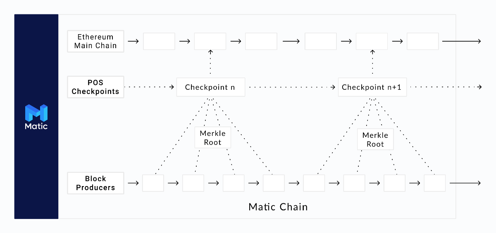
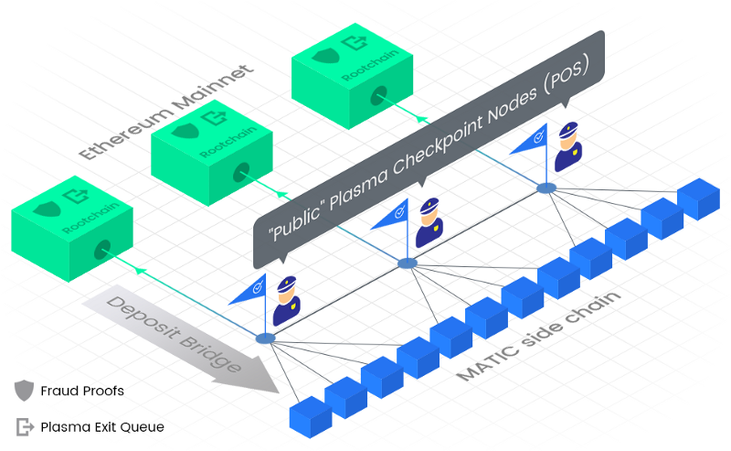
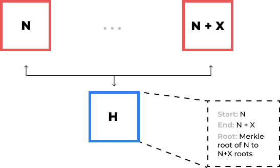

# What is Matic Network?

## Introduction

Matric network is layer 2 scaling solution that achieves scale by utility sidechains for off-chain but ensuring asset security using the Plasma Framework and a decentralization network of Proof-of-Stake(PoS).

Matric strives to solve scalability and usibility issues while not compromise on decentralization and laveraging the existing developer community and ecosytem. Matic network is an off/side chain scaling solution for existing platforms to provide scalability and superior user experimence to DApps/ user functionality.

## Key Features and Highlights

- **Scalability**: Fast, low-cost and secure transaction on Matic sidechains with finality mainchain and Ethereum as the first compatible Layer 1 basechain.
- **High Throughout**: Achived up to 10.000 TPS on a single sidechains on internal testnet and multiple chains to be added for horizontal scaling.
- **User Experience**: Smooth UX and developer abstraction from mainchain to Matic Chain, native mobile app and SDK with WalletConnect support.
- **Security**: Matic chain operators are themselves stakers in the PoS system.
- **Public Sidechain**: Matic mainchains are public in nature(. vs individual DApps chains), permissionless and capable of supporting multiple protocols.

## Value Propostion

Matic is unique in terms of techniqual approach towards Layer 2 as well as its potential support for a variety use cases.

- Matic Layer 2 is an account-based veriant MoreVP( More Visible Plasma). The Plasma Framework is used to guarentee the security of assets on the main chain(such as ERC-20 and ERC-721 tokens for Ethereums). While generic transaction is secured by the Proof on Stakes, built on top of Tendermint. Matic sidechains is essentially EVM-enabled chain and conducive to the ready deployment of solidity smart contracts, essential to make it an easy tool for Ethereum Developer to use it for scaling their DApps/Protocals.
- Commercially, Matic sidechains are structurally effective for supporting the many Decentralized Finance(DeFi) Protocols availlable in the Ethereum ecosystem.
- Matic's core philosophy is to anable DApps to compete with the user experence that is offered by centralized apps today.
- Ethereum is the first basechain Matic Network supports, but Matic intends to offer for additional basechain based on community sugession and consensus, to enable an interoperable descentralized Layer 2 Blockchain platform.

Matic strives to achieve a high degree of decentralizationn with trust -less and decentralized execution while ensuring near instant transfers, low fees and conducive economics for micro-transactions.

Matic's open source foundation intends to provide the Matic Wallet, payment APIs and SDKs, products, identity solutions and other enabling solutions that will allow developers to design, implwment and migreate DApps built on base platforms like Ethereum.

One of the key pillars of Matic Network's ideology is user experience which is very poor for blockchain applications as of now. The Matic team already built high quality Mobile/Web browser libraries with great developer experience, which will enable business to create real world end user applications at large scale. Matic roadmap also includes supporting cross-chain transfers and third party Decentralized exchanges, liquidity pools etc.

## Problems

Decentralized Apps are making huge progress but the current blockchain ecosystem is not prepared to scale as per the demand. Slow block confirmations, block size limitations and computations- in smart contract based blockchains - need to be solved before we target mass adoption by mainstream users. And most importantly, it needs awesome user experience.

Some of the problems associated with the current blockchain platforms are as follows:

### Slow transactions

Blockchain transactions are slow and have variable, sometimes exasperating transaction times. Most blockchain protocols have a limit on the block size and it can take a certain amount of tiem to generate a block. Each transaction also has to wati for multiple block confirmations due to potential chain reorganizations.

These limitations are often necessary for a public blockchain as a block need to be validated and must be downloaded bu a certain number of nodes to keep it really decentralized.

### High transactions fees

Day by day, the blockchain market is growing and crypto assets are increasingly being created, transferred, and sold, often involving multiple cryto tokens. Every decentralized applications has it'own token and economy. Paying them for their services requires on-chain transfer. Etherrum charges gas fees on each transaction.

Fees are an important factor to reward validators and prevent certain kind of security attacks like DoS. But, the problem is that fees vary depending upon the pending transaction pool size due to the limited block size.

### Low transaction throughput

Public blockchains have to maintain a certain amount of time lag between intermediate block production so as to ensure ample time for block propagation. Also, the eblock size need s to be low, so as to ensure quick propagation of the block through the network. This means that the number of transactions in a particular block needs to be fairly limited.

### Scalability

Each block on a blockchain mlust be validated by multiple nodes and/or compute state in case of a smart contract based blockchain. Each node has to manage a copy of the state and all blocks. While the chain size is increasing day by day, maintaining and validation the whole blockchain is correspondingly setting more difficult. This is a huge risk for decentralization as an idea, overall.

### Multiple micropayment channels

Some payment channel solutions solve the problem of micro-payments. However, opening and managing channels with multiple DApps or users is complex. Additionally, the speed and convenience of mediated payments over channels is still up for debate.

### Poor usability

The current system is inherently bad for normal users. 
Asthe number of ICO increases, users may want to use DApps with different tokens as payment. Without on-chain trade, the convertibility of one crypto token to another represents a new challenge for both investors alive. It introduces complexity for managing multiple crypto tokens and exchanging tokens to pay on different platforms.

## Matic Network

Matic Network solves these problems bu building a decentralized platform using an adated version of Plasma framework that provises a solution for faster and extremelu low cost transactions with finality on a main chain. 

Matic Network solves the low transaction throughout problem by using a Block Producer layer to produce the blocks. Block Producers enable the system to produce blocks at a very fast rate. The system ensures decentralization using PoS checkpoints which are pushed to the Ethereum mainchain. **This enables Matic to theoretically achieve `2^16` transation on a single side chain.**

In addition, we are developing a suite of developer tools such as the real-time notification engine for Etherum events - [Dagger](https://matic.network/dagger/) and a scalable, modular and realtime Ethereum data processor - hermione. Apart from this, the Matic team actively contributes to the WalletConnect protocol implementation.

## Architecture

When a user is transferring ETH or ERC20 tokens, they have to wait for block confirmation times which ranges from 14 seconds to 20 seconds. Also you have to wait for multiple blocks to be sure of the finaltity of the block inclusion in the chain. That's a deterrent for users to use the service.

As crytocurrency gains favor, more transactions will jam the Ethereum network and gas fees will increae on an average for each transactionn for faster confirmations by users. Note that gas fees vary as per traffic and confirmation time. We propose Matic as a solution to overcome these problems.

### Here is how Matic works:

- User deposits crypto assets in the Matic contract on mainchain (currently implemented with Ethereum blockchain only)
- Once deposited tokens get confirmed on the main chain, the corresponding tokens will ger reflected on the Matic chain.
- The user can now transfer tokens to anyone they want **instantly with negligible fees**. Matic chain has faster blocks (approximately 1 second or less). That way, the transfer will be done almost instantly.
- Once a user is ready, they can withdraw remaining tokens from the main chain by establishing proof of remaining tokens on Root contract (contract deployed on Ethereum chain)

Remember any fungible crypto assets can be rerpresented as ERC20 tokens on Matic chain. That way, the same method will work for any fungible crypto assets. In addition, we have also added support for ERC721/ NFTs (Non Fungible Tokens).

Check out on Githuh [repos](https://github.com/maticnetwork/contracts).

### Consensus and security

To provide some context, the Matic ecosystem will have the following actor:

- End Users.
- DApp developers: Developers are expected to use the Matic Network to scale their applications and provide a better UI/UX to their end users
- Stakers Stakes need to deposit/stake tokens to qualify and play a very important role in the Matic Network. They validate the transactions and propose checkpoints on the mainchain using PoS consensus mechaism with a `2/3` majority. They also choose Block Producers amongst themselves, who satisfy a certain criteria, to produce blocks on the sidechains.
- Block Producers: These are block producers chosen by Stakers who in turn enable faster blockchain generationn times. They have to provide a significant stake to be nominated.

The Matic Network uses a dual strategy of Proof of Stake at the checkpointing layer and Block Producers at the block producer layer to achieve faster blocktimes while ensuring a **high degree of decentralization by achieveing finality on the main chains using the checkpoints and fraid prood mechanisms**.

Bassically, anyone can stake their Matic tokens on root contract to become a Staker in the PoS checkpointing layer (contract deployed on Ethereum chain). This provides a high degree decentralized base layer for Matic chain.

At the blockchain layer of the Matic Network, there are Block Producers, selected by PoS Stakers on the base layer, who will be creating the Matic Blocks. To achieve faster block generation times, these Block Producers will be low in number. **This layer is expexted to achieve ~ second block generation times at extremely low to negligible transaction fees.**

On Matic Network's chackpointing layer, the basis of Matic Network's PoS mechanism, for every few blocks on the block layer of the Matic Network, a proposer will be chosen among the stakeholders to propose a checkpoint on the main chain. These checkpoints are created by the proposer after validating all the blocks on the block layer of the Matic Network and creating the Merkle tree of the block hashes since the last checkpoint. The Merkle root is the broadcasted to the Staker Network for their signatures. The order stakeholders also verify the proof. They will approve the proposed blocks, if it is valid, by providing their signatures.

The system needs the approval of `2/3` of the stakeholders to propose a "header block" to the root contract. Once the checkpoint is proposed on the mainchain, anyone on the Ethereum mainchain can challenge the proposed checkpoint within a specified prrod of time. if no one challenges it and the challenge period ends, the checkpoint if formally included as a valid checkpoint on the main chain.

Following is a illustration of the "Header block":

More on header block AKA checkpoint at [here](https://ethresear.ch/t/plasma-checkpoint-cost-and-block-time/2016).

### Fraud Proofs

To enhance the security of the transactions, Matic Network also provides Fraud Proofs on the mainchain. The mechanism enables any individual on the mainchain to submit the details of the transactions which he/sh thinks is fraudulent. If the challenge is successful, the stakes of the parties involved in the fraud are shared and the challenger receives the slashed funds as an incentive for detecting the fraud. This can be considered as an always-running high reward bounty program for any parties who widh to investigate the veracity of the transactionns on the Matic Network.

### Multi Chain Support (Horizontal Sharding)

The Matic Network public checkpointing layer supports multiple side chains by design. Theoretically, there can be an infinite number of side chains working under the secured and decentrailized layer of checkpoints. Businesses can have their dedicated side chains connected to the public checkpointing layer having full control of their execution environments, while still retaining the immutability, provability and security of transactions via the checkpointing mechanism.

Key factors influencing the design of this sharding process are expected to be:

1. Scheduling of checkpointing layer to periodically propose checkpoints for different side chains.
2. Movement of assets across multiple side chains      
   2.1 User will be able to send assets across side chains using chain ids and receipts.
    
   2.2 Users will be provided with an intuitive wallet interface to perform interchain transactions.
    
   2.3 Developers will be provided with API/SDKs to build programmable interfaces for inter chain transactions.

Movement of the assets from one chain to another will be managed at the checkpointing layer and may not require any interaction with the mainchain. Research is currently underway to facilitate faster (possibly instant) inter sidechain transfers.

### Potential Use Cases

Matic Foundation is committed to provide a scalable and user friendly ecosystem for third party Decentralized applications to thrive on. Matic Foundation like Ethereum and other platform foundations will promote various Base chain DApps(like DApps built Ethereum currently, and NEO, EOS in the future) to build and migrate their user facing applications/ transactions on  Matic Network. It will also award grants and funding to third party app developers to buld various user cases on top of Matic Network like:

#### Payments

The Matic Network will provide an interface for users, payment APIs and SDKs for DApps, merchant and users to instantly accept or pay in crypto assets.

#### Atomic swaps

Matic smart contracts will allow users to pay with any crypto token thay prefer and receiver will receive payment in assets thay prefer. Matic will handle conversion through atomic swap between cross-chain crypto assets.

#### Liquidity providers

To be continue  
Get more information at [here](https://medium.com/matic-network/what-is-matic-network-466a2c493ae1).