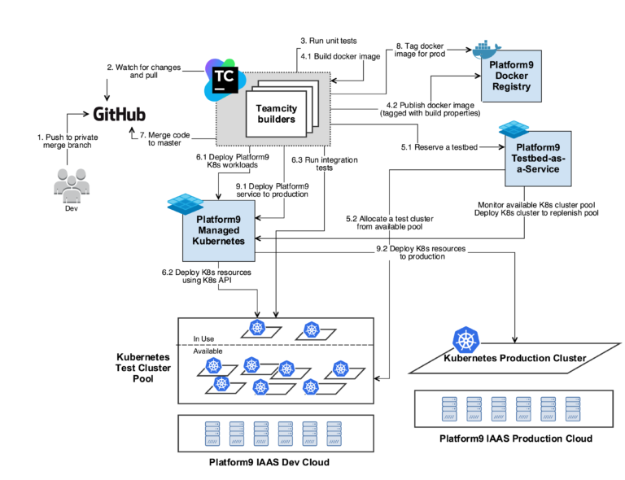

# A Recipe For Continuous Integration Using Kubernetes

Most of the today's IT dependent businesses are adopting the DevOps friendly practice of building agile and highly reliable services. A key aspect of achieving this is having a Continuous Integration/Continuous Deployment(CI/CD) pipeline in place to validate and deploy these services. Kubernetes, along with container technologies, has many built-in construct and capabilities that simplify building this pipeline. This post provides a recipe on how we achieve CI/CD with Kubernetes.

## The Benefits CI/CD with Kubernetes

- Efficient Utilization of Resources - Kubernetes provides built-in scheduling of pods (containers). This enables us to get the optimal utilization of the underlying nodes in the Kubernetes cluster. By monitoring the utilization, we are able to leverage the most out of our test infrastructure.
- Minimal Builder Setup- Containers are used to build the software and build artifacts are delivered as containers images. This eliminates the need to setup builders with different OS dependent libraries and utilities. A simple builder with just a container runtime (docker in our case) suffices.
- End-To-End Automation- The entire test life cycle is 100% automated, with very little manual intervention. This means very high developer productivity.
- Enhances Visibility - Our DevOps folks have better visibility into artifacts for current running builds and workloads. They are available for debugging and test both via UI and API when needed.

## The Ingredients (Requirements)

- Kubernetes infrastructure to run your CI/CD setup. You will need to ensure that you have enough hardware capacity to support the level of testing you intend to do.
- Access to some base container images, either from a public registry or your own private registry.
- Jenkins or TeamCity to drive yur CI/CD workflow pipeline.
- Your Version Control System (VCS) managing your source code. (Rest of this procedure assumes Git as the default VCS)

Note that the size of your deployment would depend on the scale of workload you wish to run.

## The Recipe (Procedure)

### Prep Work:

#### Ready your Kubernetes cluster(s)

CI/CD pipelines can built on top of any Kubernetes setup. If you already have a cluster available, you can move on to the next step. If not, there are many tools available to setup a Kubernetes cluster, including Platform9 Managed Kubernetes.

The beauty f Platform9 is that it makes standing up your Kubernetes cluster extremely simple, be it on a public cloud or your own private cloud.

#### Configure Your Continuous Integration (CI) Server

At Platform9, we switched to TeamCity after having years of experience running Jenkins. While both are mostly on-par with supported features, one is free while the other a paid product. Here are a [few good comparisons between the two](https://lustforge.com/2014/08/21/jenkins-vs-teamcity-the-better-ci-tool/) for those interested. Our TeamCity setup is also integrated with GitHub, which is our source version control system. For now, let's assume that the reader has knowledge of configuring build chains and dependencies in their favorite CI server.

#### The Workflow

The diagram below shows our Continuous Integration Workflow using PMK infrastructure:

### Let's Start Cookin'!

#### Step 1 - Developer pushes a changeset to Git

The moment a developer is ready to push a change to Git, a private branch gets created with a specific name pattern. TeamCity is configured to watch for changes on branches with this specific name pattern.

#### Step 2 - TeamCity initiates a build

TeamCity maintains a pool of builders. When TeamCity detects a change in the above branch, it delegates the build to one of the builders from the builder pool. The builder performs a clone of the private branch locally.

#### Step 3 - Run Unit-Tests

The first step of the build chain is to do basic validation of the change by running unit tests. The builder runs unit tests on the component which underwent a change.

If all the unit tests pass, build scripts specific to Platform9 are run to create build artifacts corresponding to our deployment.

#### Step 4 - Create build artifacts

Generally, this part would be specific to your own environment but I have captured an example of how we do it for one of our services. The build artifacts generated in this case would be docker images.

Our containerized services specify the configuration of the docker image in a Dockerfile. We also have a docker registry that hosts a bunch of base images. As per the Dockerfile, the docker image build starts with bringing up a container from those base images and is followed by the setting up the service (as per the codebase of the latest commit on the branch) within the container. The output is a new docker image of the service.

The docker images which are generated from the previous build steps are published to our docker registry. In addition to the name of the service, the image is tagged with a major version, the TeamCity build number and the git hash of the branch. This is to help us identify this image at later point in time.

#### Step 5 - Reserve a test Kubernetes cluster

The next step of our TeamCity build configuration is to allocate an environment for integration tests. Our test infrastructure has an internal tool, testbed-as-a-service, that maintains a pool of Kubernetes clusters for testing purposes. This service manages the cluster pool using our own deployment of Platform9 Managed Kubernetes, via its REST API. The purpose of the pool is to reduce test runtimes by having the clusters pre-created. We have a few standardized cluster specifications. Each specification varies by the size of the node and the number of nodes in the cluster. Depending on the use being tested, an appropriate cluster is requested from the testbed service.

Note that our integration test suite comprises to testing multiple such use cases in a single run.

#### Step 6 - Running integration tests

Once the cluster is reserved, the TeamCity builder triggers the deployment of the workloads being tested. The Kubernetes Deployment specification for these workloads may consist of multiple pods. This is primarily to deploy dependent services that are necessary for the service we are testing. During this deployment, all the pods are deployed using docker images from our registry that are tagged as `production ready` for the current version.

Using Kubernetes rolling update feature, we then updated the service being tested with the image we tagged in Ste above.

#### Step 7 - Merge the code and validate master

Once the tests pass, TeamCity merges the code from the private branch to the master branch. We repeat steps 1 through 6 again, but this time for the code on the master branch. You may be wondering why we run the tests on the private branch first and then master. This is to keep the master branch pristine and only validated code gets merged into master.

#### Step 8 - Certify the build

If all the steps n the validation of the master branch pass, we have a production ready docker image for the service. In this case, we tag this docker image of the service with a new version, build number and production/latest tag.

#### Step 9 - Deploy to production

The service is rolled out to production deployments, again using Kubernetes rolling update capability. The docker images are chosen from our registry using the tag we added in the previous step.

If any step in the above workflow fails, the build is marked as a failure and the remainder of the build steps are aborted. The component responsible development team is notified of the failure and they perform the necessary diagnostics and fixes to get the build successful again.

This completes our code rol out process leveraging our own Kubernetes product, along with docker container capabilities.

To recap, this recipe has helped Platform9 with

- Building a more agile, automated yet simple test and deploy workflow.
- Optimized test and deploy run times.
- Increased efficiency with our infrastructure utilization
- Simplified build infrastructure setup.

Get more information at [here](https://platform9.com/blog/a-recipe-for-continuous-integration-using-kubernetes/).