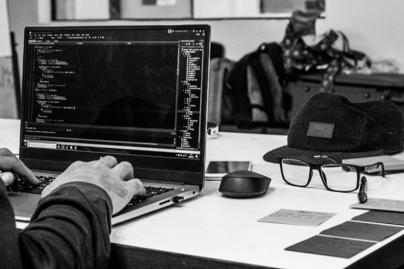

# How to be a great programmer

## Problem Solver Extraordinaire

Although therre are many ways to solve a problem, there are a few parts of the process that stand out to me. Programmers who are also great problem solvers distell a problem to its essence, in order to identify their overall aim and begin a problem with purpose. Then, they break each problem into small, manageable parts- attacking each part in turn, and sometimes in visual terms by drawing a picture to mke it "real world".

Things began to change when I began learning about the problem solving process, and how to problem solve effectively. I now begin a problem with intent. I have Geoge Polya's book, _How to Solve It_, to thank for that bit of advice.

I've adapted some of Polya's ideas to programming, like understanding the problem. "The problem must be understood," Polya writes. This includes being able to "point out the principal parts of the problem, the unknown, the data and the condition." For each problem, I pull out a sheet of paper and weite answers to these questions: what am I solving for or trying to find? (unknown); what am I given?(data); and what constraints or details do I need to be aware of? (condition).

Writing out problem details slows me doen metall, and helps me think through exactly what I need to do, which is half of the battle. There are many ways to go about this. Sometimes I outline the steps I need to take in numerical order: first do this , second do that. Other times I make the problem visual.

I'll also draw pictures or diagrams. For a recursive problem, I'll draw a diagram of what's happending on each recursive call until I hit the base case. Almost always, however, I find a way to simplify the problem to make ti more manageabl and to help me spot a pattern. Above all, the aim for me is to enter a problem with purpose, and maintain that sense of purpose throughout.

## What about your Computer?

Learning computer science is the second programming funcdametal. I recently started learning computer science and love it because I'm moving beyond surface level. I'm going "behind the scenes" to learn what happens when I use a built-in funcrion, for example. I'm also learning about memory and run time, among many other topics. in short, I'm learning _why_ a computer does the things it does.

Knowing the "why" enhances my contextual knowledge and makes me a more informed programmer. It's also enriching my understanding of how core programming concepts work. Programmers who master the fundamentals seem to code with confidence: thay know the "how" and "why" of their programming choices, which improve their work and builds their credibility with others.

Get more information at [here](https://medium.freecodecamp.org/how-to-be-a-great-programmer-34939494996d)
