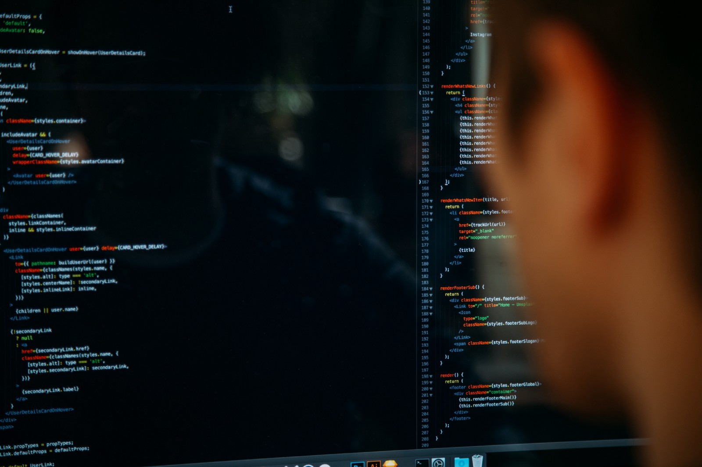

# How to debug web apps with firefox developer tools

By knowing how to debug your web app, you can leverage developer tools to hack your productivity. After reading this article, you'll be able to:

- debug mobile and tablet version of your web application on your computer.
- connect the mobile Firefox application to your computer and debug web applications there.
- find the fonts and styles that best fit your website withour having to build your CSS and JS code again and again.
- fin problems in your CSS layout.

Finally, at the end - I am going to tell yu how to install the powerful **Firefox Developer Edition**.

Get more information at [here](https://medium.com/@sukantk3.4/how-to-debug-web-apps-with-firefox-developer-tools-64a9f531af90).
