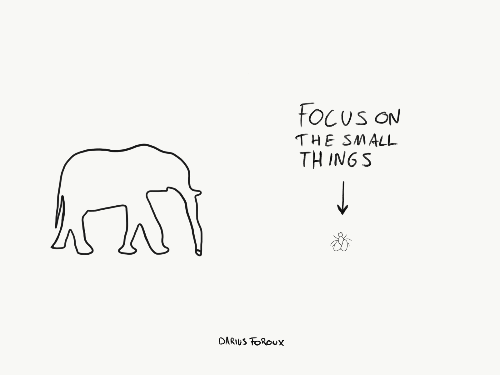

# 4 Practical things I do to stay positive

Not blaming others nor yourself is one of the most important things if you want to stay positive. But there are also 4 other things I do to stay positive. Here they are:

## 1. Practice garatitude

Taking a few moments every day to write down a few things your grateful for changes your perspactive. The funny thing about this practice is that when you read about it, you think "It can't be THAT effective!".

Remmber that you can also be gratefull for things that you didn't ask for [Be gratefull for everything - even the bed things](https://dariusforoux.com/thank-you/)

## 2. Don't take it personally

Well, maybe it's time to lighten up a bit. We overanalyze every single thing people say and do. Sometimes, prople just to do dumb things. Not everything people do is personal.

If you want to live a good lige, you can't take everytthing peronally. Understand that there are more important things to life - things like your health, family and career.

## 3. Let it out

[We all deal with fifficult thins in our lives.](https://dariusforoux.com/get-back-track/)

Life is basically one challenge after the other. We can't let that get the best of us. That's whay we need to let it all out.

All your anger, frustration, anxiety, insecurity - it needs to get our of your system. Whether you do that by journaling, tailking to a friend, or going to therapy is your choice. Just make sure you don't keep all those things inside yourself.

## 4. Focus on improvement

Don't send one second on feeling sorry for yourseld and focus on what you can do NOW to improve something about your life. It doesn't even matter what it is.

got for a walk. take a shower, Shave, [Start a journal](https://dariusforoux.com/how-to-journal/). Fix something in your house. Write down some ideas. [Set a goal](https://dariusforoux.com/goals-dont-replace-systems%e2%80%8a/).

You can even do those things while you're feeling bad.

The author of the famous self-help book. [Think And Grow Rich](https://www.amazon.com/gp/product/1906465592/ref=as_li_qf_asin_il_tl?ie=UTF8&tag=dariusforoux-20&creative=9325&linkCode=as2&creativeASIN=1906465592&linkId=f894c855fe9dfdf4b614225804df3307), put it:

    "*If you cannot do great things, do small things in a great way.*"

It's unquestionable: Doing small things will make you feel better. But you don't need to believe me. Just go and do small thing now and see it for yourself.

Get more information at [here](https://medium.com/darius-foroux/4-practical-things-i-do-to-stay-positive-354ab115cf01).
