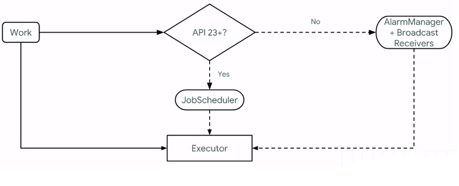
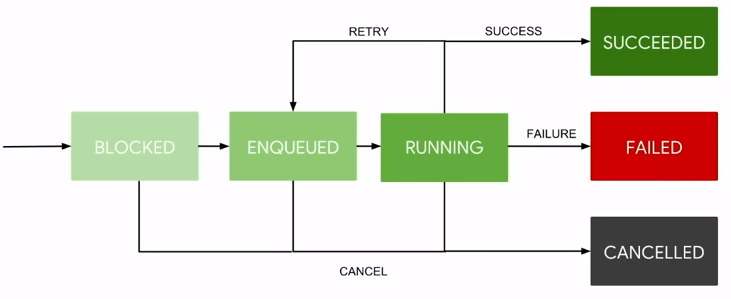
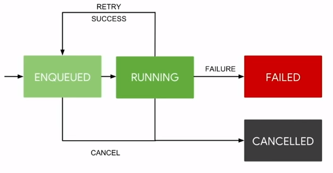

# Getting Started With WorkManager

If you need to schedule a background task on Android, you're probably familiar with all of the various ways to accomplish this such as:

- Google Cloud Messaging
- Firebase Cloud Messaging
- DownloadManager
- Foreground Service
- Alarm Manager
- etc

## WorkManager

Give a warm welcome to WorkManager. WorkManager is a library that makes it easy to schedule deferrable, asynchronous tasks even if the app exits ot the device restarts. It was designed to be backwards compatible to API 14 and does so by wrapping JobScheduler, AlarmManager, and BroadcastReceivers all in one.

Using JobScheduler your app will be running on na device that is API 23+. Anything below, you'll be using combination of AlarmManager + BroadcastReceivers.

### How is work executed?

Work is fed to an executor to guarantee the work is done.

Thee executor will complete the work so long as it meets the constraints that you set up when you enqueue the work.

### Async by Default

Every operation is asynchronous. Thus you won't have to worry about threading at all. The operations are saved in a WorkManager database that is the source of truth for any enqueued, successful, or cancelled operations.

### When does work end?

- Upon the work finishing.
- In the event that the constraints are no longer met(Network could be lost, Phone is no longer plugged,etc)
- The OS decied to kill your enqueued work.
- you cancelled your work.

### Lifetime of work

#### One Time Work

This type of work's final state is `Successed` when completed. Otherwise it will go into a `Failed` or `Cancelled` state.

#### Periodic Work

This type of work does not have a dinal state because it has either a finite or infinite amount of iterations. Thus it will continuously enqueue and run.

Get more imformation at [here](https://devblogs.microsoft.com/xamarin/getting-started-workmanager/).