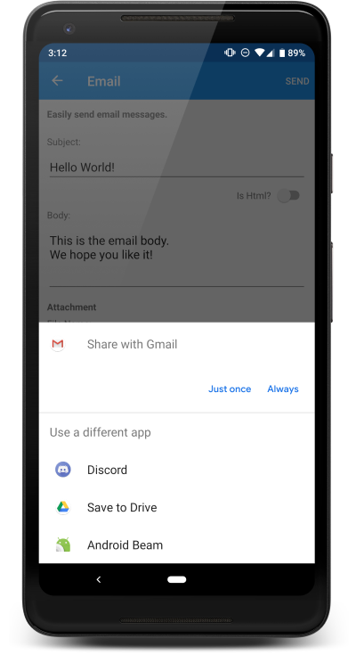

# Sharing Files & Email Attachments with Xamrin.Essentials Preview Features

<hr/>

## Enabling Previews
The Xamarin.Essentials team has adopted one of their favorite features from Xamarin.Forms. The "**feature flag**" approach that enables developers to try out new features before they are officially released. This is a great addition for developers who want early access because special build installation is not needed. Above all, it allows the team to repidly work on the API and make feedback-based changes if needed. To enable preview features in Xamarin.Essentials there is a new **ExperimentalFeature** class with a single method on it, **Enable**. This method takes in string arguments that represent the feature to enable. Here we can enable both email attachments and sharing files:
```Csharp
ExperimentalFeatures.Enable(ExperimentalFeatures.EmailAttachments, ExperimentalFeatures.ShareFileRequest);
```
This can be done at any point in the applicationn lifecycle but must be called before using the new APIs.

## Email Attachments

This feature anables an app to emails files in email clients on the device. After the feature enabled any file can be emailed. Xamarin.Essentials will automatically detect the file type(MIME), then request the file to be added as an attachment. Every email client is different a may only support specific file extensions or none at all.

here is sample of writing text to disk and adding it as an email attachment:

```Csharp
var message = new EmailMessage
{
    Subject = "Hello",
    Body = "World",
}
var fn = "Attachment.txt";
var file = Path.Combine(FileSystem.CacheDirectory, fn);
File.WriteAllText(file, "Hello World");

message.Attachments.Add(new EmailAttachment(file))
await Email.ComposeAsync(message);
```



## Sharing a File

This feature also enables an app to share files with other applications on the device. Xamarin.Essential will automatically detect the file type (MIME) while requesting a share. Each platform may only support specific file extensions.

Here is a sample of writing text to disk and sharing it to other apps:
```Csharp
var fn = "Attachment.txt";
var file = Path.Combine(File.System.CacheDirectory, fn);
File.WriteAllText(file, "Hello World");

await Share.RequestAsync(new ShareFileRequest {
    Title = Title;
    File = new ShareFile(file)
})
```

As you can see that the Xamarin.Essentials APIs work really well together for the ability to get file directories, save file to disk, and share the with the world!

<hr/>

Get more information at [here](https://devblogs.microsoft.com/xamarin/sharing-files-attachments-xamarin-essentials/).