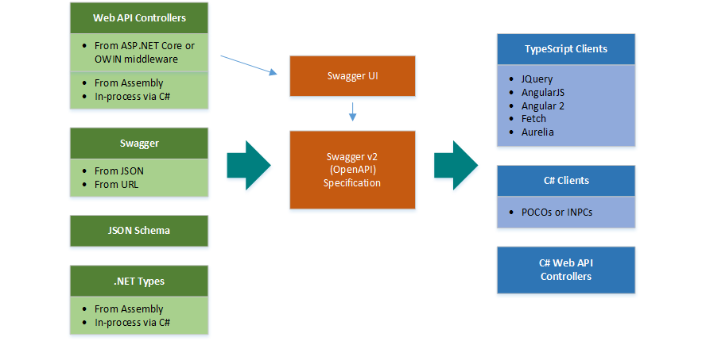

# NSwag: The Swagger/OpenAPI toolchain for .NET, ASP.NET Core and TypeScript

Nwag is a Swagger/OpenAPI 2.9 and 3.9 toolchain for .NET, .NET Core, Web API, ASP.NET Core, TypeScript (jQuery, Angularjs,Angular 2+, Aurelia, KnockoutJS and more) and other platforms, written in C#. The Swagger specification JSON and JSON Schema to descrine a RESTful web API. The NSwag project provide tools to generate Swagger specification from existing ASP.NET Web API controllers and client code from these Swagger specifications.

The project combines the functionality of Swashbuckle (Swagger generation) and AutoRest (client generation) in one toolchain. This way a lot of incompatibilities can be avoided and features which are not well described by the Swagger specification or JSON Schema are better supported.

## Features:

- [Generate Swagger 2.0 and OpenAPI 3.0 specification from C# ASP.NET (Core) controllers](https://github.com/RicoSuter/NSwag/wiki/Middlewares).
- Serve the specs via ASP.NET (Core) middleware, optionally with [Swagger UI](https://github.com/swagger-api/swagger-ui) or [ReDoc](https://github.com/Rebilly/ReDoc)
- Generate C# or Type Script clients/proxies from these specs.
- Everything can be automated via CLI (distributed via NuGet tool or build target; or NPM)
- CLI configured via JSON file or NSwagStudio Windows UI

## Ways to use the toolchain:

- Simple to use Windows GUI, NSwagStudio
- By using the Swagger or Swagger UI OWIN and ASP.NET Core Middlewares (also serves the [Swagger UI](https://github.com/swagger-api/swagger-ui))(recommended)
- Via [command line](https://github.com/NSwag/NSwag/wiki/CommandLine) (Windows, Mac and Linux suport through [Mono](http://www.mono-project.com/) or .NET Core console binary, also via [NPM package](https://www.npmjs.com/package/nswag))
- In your C# code, via [NuGet](https://www.nuget.org/packages?q=NSwag)
- In your [MSBuild targets](https://github.com/NSwag/NSwag/wiki/MSBuild).
- With [ServiceProjectReference](https://github.com/NSwag/NSwag/wiki/ServiceProjectReference) tags in your .csproj (preview)
- In your [Azure V2 Functions](https://github.com/Jusas/NSwag.AzureFunctionsV2) (external project, might not use latest NSwag version)

## Tutorials

- [Video Tutorial: How to integrate NSwag into your ASP.NET COre Web API project (5 mins)](https://www.youtube.com/watch?v=lF9ZZ8p2Ciw)
- [Integrate the NSwag toolchain into your ASP.NET Web API project](https://blog.rsuter.com/nswag-tutorial-integrate-the-nswag-toolchain-into-your-asp-net-web-api-project/)
- [Generate an Angular TypeScrip client from an existing ASP.NET Web API web assembly](https://blog.rsuter.com/nswag-tutorial-generate-an-angular-2-typescript-client-from-an-existing-asp-net-web-api-web-assembly/)

Get more information at [here](https://github.com/RicoSuter/NSwag).
