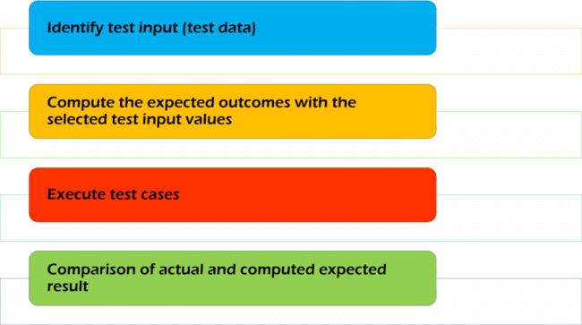

# Functional Testing

## What is Functional Testing ?

Functional Testing is defined as a type of testing which verifies that each **function** of the software application operates in conformance with the requirement specification. This testing mainly involves black box testing and it is not concerned about the source code of the application.

Each and every functionality of the system is tested by providing appropriate input, verifying the ourput and comparing the actual results with the expected results.

This testing involves checking of User Interface, APIs, Database, security, client/server applications and functionality of the Application Under Test. The testing can be done either manually or using automation.

## What do you test in Functional Testing ?

The prime objective of Functional testing is checking the functionalities of the software system. It mainly concentrates on:

- **Mainline functions**: Testing the main functions of an application.
- **Basic Usability**: It involves basic usability testing of the system. It checks whether a user can freely navigate through the screens without any difficulties.
- **Accessibility**: Checks the accessibility of the system for the user.
- **Error Conditions**: Usage of testing techniques to check for error conditions. It checks whether suitable error messages are displayed.

## How to perform Functional Testing: Complete Process

In order to functionally test an application, the following steps must be observed.

- Understan the Software Engineering Requirements.
- Identify test input (test data)
- Compute th expected outcomes with the selected test input values.
- Execute test cases.
- Comparison of actual and computed expected result.

Get more information at [here](https://www.guru99.com/functional-testing.html).
