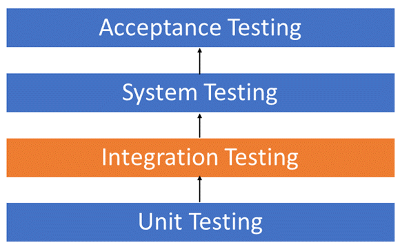
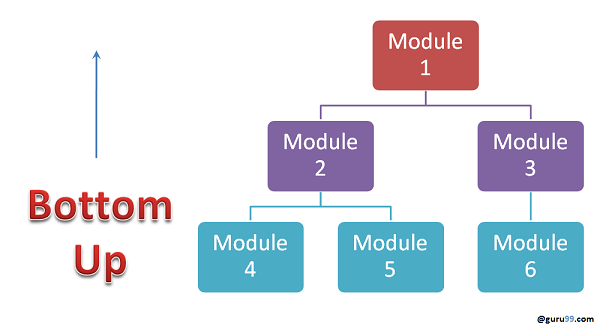

# Integration testing

Integration testing is the phase in software testing in which individual software modules are combined and tested as a group. Integration testing is conducted to evaluate the compliance of a system or component with specified in an integration test plan to those aggregates, and delivers as its output the integrated system ready for system testing.

## Why do Integration Testing

Althoudh each software module is unit tested, defects still exist for various reasons like

- A Module, in general, is designed by an individual software developer whose undrstanding and programming logic may differ from other programmers. Integration Testing becomes necessary to verify the software modules work in unity.
- At the time of module development, there are wide chances of change in requirements by the clients. These new requirements may not be unit tested and hence system ntegration Testing becomes necessary.
- Interfaces of the software modules with the database could be erroneous.
- External Hardware interfaces, if any, could be erroneous.
0 Inadequate exception handling could cause issues.

## Approach

Some different types of integration testing are big-bing, mixed(sandwich), risky-harded, top-down, and bottom-up. Other Integration Patterns are: collaboration integration, backbone integration layer integration, client-sever integration, distributed services integration and high frequency integration.

Software Engineering defines variety of strategies to execute Integration testing:

- Big Bang Approach.
- Incremental Approach: which is further divided into the following:
  - Top Down Approach
  - Bottom Up Approach
  - Sandwich Approach - Combination of Top Down and Bottom Up

### Big Bang Approach

Here all component are integrated together at **once** and then tested.

#### Advantages

- Convenient for small systems.

#### Disadvantages

- Fault Localization is difficult.
- Given the sheer number of interfaces that need to be tested in this approach, some interfaces link to be tested could be missed easily.
- Since the Integration testing can commence only after "all" the modules are designed, the testing team will have less time for execution in the testing phase.
- Since all modules are tested at once, high-risk critical modules are not isolated and teted on priority. Peripheral modules which deal with user interfaces are also not isolated and tested on priority.

### Incremental Approach

In this approah, testing is done by joining two or more modules that re **logically related**. Then the other related modules are added and test for the proper functioning. The process continues until all of the modules are joined and tested sucessfully.

Incremental Approach, in turn, is carried out by two different Methods:

- Bottom Up
- Top Down

#### What is Sub and Driver?

- Incremental Approach is carried out by using dummy progrms called **Stubs and Drivers**. Stubs and Drivers do not implement the entire programming logic of the software module but just simulate data communication with the calling module.

**Stub**: Is called by the Module under Test.

**Driver**: Calls the Module to be tested.

#### Bottom-up Integration

In the bottom-up strategy, each module at lower levels is tested with higher modules until all modules are tested. It takes help of Drivers for testing.

##### Advantages Bottom Up

- Fault localization is easier.
- No time is wasted waiting for all modules to be developed unlike Big-bang approach.

##### Disadvantages Bottom Up

- Critical modules which control the flow of application are tested last and may be prone to defects.
- An early prototype is not possible.

#### Top-down Integration

In top to down approach, tsting takes place from top to down following the control flow of the software system.

##### Advantages Top Down

- Fault Localization is easier.
- Possibility to obtain an early prototype.
- Critical Modules are tested on priority; major design flaws could be found and fixed first.

##### Disadvantages Top Down

- Needs many Stubs.
- Modules at a lower level are tested inadequately.

## How tio do Integration Testing?

The Integration test procedure irrespective of the Software testing strategies:

1. Prepare the Integrtion Tests Plan
2. Design the Test Scenarios, Cases, and Scripts.
3. Executing the test Cases followed by reporting the defects.
4. Tracking & re-testing the defects.
5. Steps 3 and 4 are repeated until the completion of Integration is successful.

## Best Practice/ Guideline for Integration Testing

- First, determine the Integration [Test Strategy](https://www.guru99.com/how-to-create-test-strategy-document.html) that could be adopted and later prepare the test cases and test data accordingly.
- Study the Architecture design of the Application and identify the Critical Modules.
- Obtain the interface designs from the Architectural team and create test cases to verify all of the interfaces in detail. Interface to database/external hardware/ software application must be tested in detail.
- After the test cases, it's the test data which plays the critical role.
- Always have the mock data prepared, prior to executing.

Get more inforamtion at [here](https://www.guru99.com/integration-testing.html).
