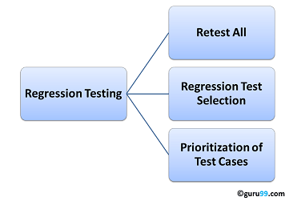

# Regression Testing

## What is Regression Testing?

Regression Testing is defuned as a type of software testing to confirm that a recent program or code change has not adversely affected existing features.

Regression Testing is nothing of already executed test cases which are re-excuted to ensure existing functionalities work find.

This testing is done to make sure that new code changes should not have side effects on the existing functinalities. It ensures that the old code still works once the new code changes are done.

## Need of Regression Testing

Regression Testing is requred when there is a

- Change in requirements and code is modified according to the requirement.
- New feature is added to the software.
- Defect fixing.
- Performance issue fix.

## How to do Regression Testing

Software maintence is an activity which includes enhancements, error corrections, optimization and deletion of existing features. These modifications may cause the system to work incorrectly. Therefore, Regression Testing becomes necessary. Regression Testing can be carried out using the follwoing techniques:

### Retest All

- This is one of themethods for Regression Testing in which all the tests in the existing test bucket or suite should be re-executed. This is very expensive as it requires huge time and resources.

### Regression Test Selection

- Instead of re-executing the entire test suite, it is better to select part of the test suite to be run.
- Test cases selected can be categorized as 1) Reusable Test Cases 2) Obsolete Test Cases.
- Re-usable Test cases can be used in succeeding regression cycles.
- Obsolete Test Cases can't be used in succeeding cycles.

### Prioritization of Test Cases

- Prioritize the test cases depending on business impact, critical & frequently used functionalities. Selection of test cases based on priority will greatly reduce the regression test suite.

## Selecting test cases for regression testing

Effective Regression Tests can be done by selecting the following test cases:

- Test cases which have frequent defects.
- Functionalities which are more visible to the users.
- Test cases which verify core features of the product.
- Test cases of Functionalities which has undergone more and recent changes.
- All Integration Test Cases.
- All Complex Test Cases.
- Boundary value test cases.
- A sample of Successful test cases.
- A sample of Failure test cases.

## Regression Testing and Configuration Management

Configuration Management during Regression Testing becomes imperative in Agile Enviroments where a code is being continuously modified. To ensure effective regression tests, observe the following:

- Code being regression tested should be under a configuration management tool.
- No changes must be allowed to coe during the regression test phase. Regression test code must be kept immune to developer changes.
- The database used for regression testing must be isolated. No databse changes must be allowed.

Get more information at [here](https://www.guru99.com/regression-testing.html).
