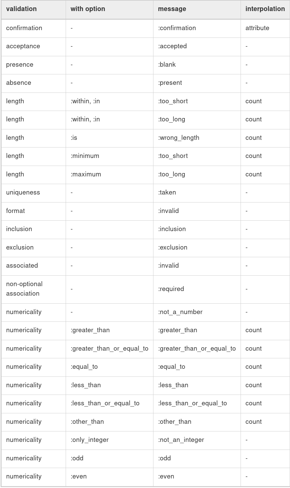

# Rails Internationalization (I18n) API

<hr/>

In the process of internationalizing your Tails application you have to:

- **Ensure you have support for i18n.**
- **Tell Rails where to find locale dictionaries.**
- **Tell Rails how to setm preserve and switch locales.**

In the process of localizing your application you'll probably want to do the following three things:

- **Replace or supplement Rails' default locale -e.g date and time formats, month names, Active Record model names, etc.**
- **Abstract strings in your application into keyed dictionaies -e.g. flash messages, static text in your views, etc.**
- **Store the resulting dictionaries somewhere.**

After reading this guide, you will kow:

- **How I18n works in Ruby on Rails**
- **How to correctly use I18n into a RESTful application in various ways.**
- **How to use I18n to translate Active Record errors or Action Mailer E-mail subjects**
- **Some other tools to go further with the translation process of your application.**

<hr/>

## How I18n in Ruby on Rails Works

The Rails I18n API focuses on:

- Providing support for English and similar languages out of the box.
- making it easy to customize and extend everything for other languages.

As part of this solution, **every static string in the Rails framework** -e.g Active Record validation messages, time and date formats - **has been internationalized.** _Localization_ of a Rails application means defining translated values for these strings in desired languages.

### The Overall Architecture of the Library

Thus, the Ruby I18n gem is split into two parts:

- The public API of the i18n framework - a Ruby module with public methods that define how the library works.
- A default backend(which is intentionally named Simple backend) that implements these methods.

### The Public I18n API

The most important methods of the I18n API are:

    translate # Lookyp text translations
    lacalize # Localize Date and Time objects to local formats

These have the aliases #t and #l so you can use them like this:

    I18n.t 'store.title'
    I18n.l Time.now

There are also attribute readers and writers for the following attributes:

    load_path                 # Announce your custom translation files
    locale                    # Get and set the current locale
    default_locale            # Get and set the default locale
    available_locales         # Whitelist locales available for the application
    enforce_available_locales # Enforce locale whitelisting (true or false)
    exception_handler         # Use a different exception_handler
    backend                   # Use a different backend

## Setup the Rails Application for Internationalization

### Configure the I18n Module

Rails add all .rb and .yml files from the config/locales directory to the **translations load path**, automatically.

The default en.yml locale in this directory contains a sample pair of translationn strings:

```yml
en:
  hello: "Hello world"
```

The **translation load path**(I18n.load_path) is an array of paths to files that will be loaded automatically.You can change the default locale as well as configure the translations load paths in config/application.rb as follows:

```ruby
# config/initializers/locale.rb

# Where the I18n library should search for translation files
I18n.load_path += Dir[Rails.root.join('lib', 'locale', '*.{rb,yml}')]

# Whitelist locales available for the application
I18n.available_locales = [:en, :pt]

# Set default locale to something other than :en
I18n.default_locale = :pt
```

### Managing the Locale across Requests

The default locale is used for all translations unless I18n.locale is explicitly set.

The locale can be set in a before_action in the ApplicationController:

```ruby
before_action :set_locale

def set_locale
  I18n.locale = params[:locale] || I18n.default_locale
end
```

This example illustrates this using a URL query parametr to set the locale(e.g: http://example.com/books?locale=pt)

#### Setting the Locale from the Domain Name

This has several advantages:

- The locale is an obvious part of the URL.
- Peoplee intuitively grasp in which language the content will be displayed.
- It is very trivial to implement in Rails.
- Search engines seem to like that content in different languages lives at different, inter-linked domains.

You can implement it like this in your ApplicationController:

```ruby
before_action :set_locale

def set_locale
  I18n.locale = extract_locale_from_tld || I18n.default_locale
end

# Get locale from top-level domain or return +nil+ if such locale is not available
# You have to put something like:
#   127.0.0.1 application.com
#   127.0.0.1 application.it
#   127.0.0.1 application.pl
# in your /etc/hosts file to try this out locally
def extract_locale_from_tld
  parsed_locale = request.host.split('.').last
  I18n.available_locales.map(&:to_s).include?(parsed_locale) ? parsed_locale : nil
end
```

We can also set the locale from the subdomain in a very similar way:

```ruby
# Get locale code from request subdomain (like http://it.application.local:3000)
# You have to put something like:
#   127.0.0.1 gr.application.local
# in your /etc/hosts file to try this out locally
def extract_locale_from_subdomain
  parsed_locale = request.subdomains.first
  I18n.available_locales.map(&:to_s).include?(parsed_locale) ? parsed_locale : nil
end
```

if your application includes a locale switching menu, you would then have something like this in it:

```ruby
link_to("Deutsch", "#{APP_CONFIG[:deutsch_website_url]}#{request.env['PATH_INFO']}")
```

assuming you would set APP_CONFIG[:deutsch_website_url] to some value like http://www.application.de

#### Setting the Locale from URL Params

We can include something like this in our ApplicationController then:

```ruby
# app/controllers/application_controller.rb
def default_url_options
  { locale: I18n.locale }
end
```

Every helper method dependent on url_for will now **automatically include the locale in the query string.** like this: http://localhost:3001/?locale=ja.

You probably want URLs to look like this: http://www.example.com/en/books, you just have o set up your routes with [scope](http://api.rubyonrails.org/v5.2.3/classes/ActionDispatch/Routing/Mapper/Scoping.html):

```ruby
# config/routes.rb
scope "/:locale" do
  resources :books
end
```

If you don't want to force the use of a locale in your routes you can use an optional path scope(denoted by the parentheses) like so:

```ruby
# config/routes.rb
scope "(:locale)", locale: /en|nl/ do
  resources :books
end
```

You would probably neef to map URLs like these:

```ruby
# config/routes.rb
get '/:locale' => 'dashboard#index'
```

#### Setting the Locale from User Preferences

A User's selected locale preference is persisted in the database and used to set the locale for authenticated requests by that user.

```ruby
def set_locale
  I18n.locale = current_user.try(:locale) || I18n.default_locale
end
```

#### Choosing an Implied Locale

When an explicit locale has not been set for a request, an application should attempt to infer the desired locale.

##### Inferring Locale from the Language Header

A trivial implementation of using an Accept-Language header would be:

```ruby
def set_locale
  logger.debug "* Accept-Language: #{request.env['HTTP_ACCEPT_LANGUAGE']}"
  I18n.locale = extract_locale_from_accept_language_header
  logger.debug "* Locale set to '#{I18n.locale}'"
end

private
  def extract_locale_from_accept_language_header
    request.env['HTTP_ACCEPT_LANGUAGE'].scan(/^[a-z]{2}/).first
  end
```

##### Inferring the Locale from IP Geolocation

The IP address of the client making the request can be used to unfer the client's region and thus their locale. Services such as [GeoIP Lite Country](http://www.maxmind.com/app/geolitecountry) or gems like [geocoder](https://github.com/alexreisner/geocoder) can be used to implement this approach.

#### Storing the locale from the Session or Cookies

You may the tempted to store the chosen locale in a sesseion or a cookie. However, **do not do this**. The locale should be transparent and a part of the URL. This way you won't break people's basic assumptions about the web itself: if you send a URL to a friend, they should see the same page and content as you. A fancy word for this would be that you're being [RESTful](https://en.wikipedia.org/wiki/Representational_State_Transfer). Read more about the RESTful approach in [Stefan Tilkov's articles](https://www.infoq.com/articles/rest-introduction). Sometimes there are exceptions to this rule and those are discussed below.

## Internationalization and Localization

### Abstracting Localized Code

Rails add a t (translate) helper method to your views so that you do not need to spell out I18n.t all the time. Additionally this helper will catch missing translations and wrap the resulting error message into a `<span class="translation_missing">`.

### Providing Translation for Internationalized Strings

Add the missing translations into the translation dictionary files

```yml
# config/locales/en.yml
en:
  hello_world: Hello world!
  hello_flash: Hello flash!

# config/locales/pirate.yml
pirate:
  hello_world: Ahoy World
  hello_flash: Ahoy Flash
```

### Passing Variables to Translations

To create proper abstraction, the I18n gem shops with a feature called variable interpolation that allows you to use variables in translation definitions and pass the values for these variables to the translation method.

Proper abstractionn is shown in the following example:

```ruby
# app/views/products/show.html.erb
<%= t('product_price', price: @product.price) %>
```

```yml
# config/locales/en.yml
en:
  product_price: "$%{price}"

# config/locales/es.yml
es:
  product_price: "%{price} €"
```

**Notes:** The default and scope keywords are reserved and can't be used as variable names. If used, an I18n::ReservedInterpolationKey exception is raised. If a translation expects an interpolation variable, but this has not been passed to #translate, an I18n::MissingInterpolationArgument exception is raised.

### Adding Date/Time Formats

To localize the timeformat you pass the Time object to I18n.l or (preferably) use Rails' #l helper. You can pick a format by passing the :format option ,by default the :default format is used.

```erb
# app/views/home/index.html.erb
<h1><%= t :hello_world %></h1>
<p><%= flash[:notice] %></p>
<p><%= l Time.now, format: :short %></p>
```

And in our pirate file let's add a time format (it's already there in Rails' defaults for English):

```yml
# config/locales/pirate.yml
pirate:
  time:
    formats:
      short: "arrrround %H'ish"
```

### Inflection Rubles For Other Locales

Rails allows you to define inflection rules (such as rules for signularization and pluralization) for locales other than English. In config/initializers/inflections.rb you can define these rules for multiple locales. The initializer contains a default example for specifying additional rules for English; follow that for other locales as you see fit.

### Localized Views

You can make use of this features, when working with a large amount of static content, which would be clumsy to put inside YAML or Ruby dictionaries. Bear in mind, though, that any change you would like to do later to the template must be propagated to all of them.

### Origanization of Locale Files

When you are using the default Simple Store shipped with the i18n library, dictionaries are stored in plain-text file on the disk. Putting translations for all parts of your application in one file per locale could be haed to manage. Yu can store these files in a hierarchy which make sense to you.

Your config.locales directory could look like this:

```
|-defaults
|---es.rb
|---en.rb
|-models
|---book
|-----es.rb
|-----en.rb
|-views
|---defaults
|-----es.rb
|-----en.rb
|---books
|-----es.rb
|-----en.rb
|---users
|-----es.rb
|-----en.rb
|---navigation
|-----es.rb
|-----en.rb
```

For this to work, we must explicitly tell Rails to look further:

```ruby
# config/application.rb
config.i18n.load_path += Dir[Rails.root.join('config', 'locales', '**', '*.{rb,yml}')]
```

## Overview of the I18n API Features

Covered are features like these:

- looking up translations
- interpolating data into translations
- pluralizing translations
- using safe HTML translations
- localizing dates, numbers, currency, etc

### Looking up Translations

#### Basic Lookup, Scopes and Nested Keys

Thus the following calls are equivalent:

```ruby
I18n.t 'activerecord.errors.messages.record_invalid'
I18n.t 'errors.messages.record_invalid', scope: :activerecord
I18n.t :record_invalid, scope: 'activerecord.errors.messages'
I18n.t :record_invalid, scope: [:activerecord, :errors, :messages]
```

#### Defaults

Following first tries to translate the key :missing and then the key :also_missing. As both do not yield a result, the string "Not here" will be returned:

```ruby
I18n.t :missing, default: [:also_missing, 'Not here']
# => 'Not here'
```

#### Bulk and Namespace Lookup

To look p multiple translations at oncne, an array of keys can be passes:

```ruby
I18n.t [:odd, :even], scope: 'errors.messages'
# => ["must be odd", "must be even"]
```

Also, a key can translate to a hash of grouped translations:

```ruby
I18n.t 'activerecord.errors.messages'
# => {:inclusion=>"is not included in the list", :exclusion=> ... }
```

#### "Lazy" Lookup

Rails implements a conveniaent way to look up the locale inside views. When you have the following dictionary:

```yml
es:
  books:
    index:
      title: "Título"
```

you can look up the boos.index.title value inside app/views/books/index/html.erb template like this (note the dot):

```erb
<%= t '.title' %>
```

Automatic translation scoping by partial is only available from the translate ciew helper method.

"Lazy" lookup can also be used in controllers:

```yml
en:
  books:
    create:
      success: Book created!
```

This useful for setting flash messages for instance:

```ruby
class BooksController < ApplicationController
  def create
    # ...
    redirect_to books_url, notice: t('.success')
  end
end
```

### Pluralization

The :count interpilation variable has a special role in that it both is interpolated to the translation and used to pick a pluralization from the translations according to the pluralization rules defined in the pluralization backend. By default, only the English pluralization rules are applied.

```ruby
I18n.backend.store_translations :en, inbox: {
  zero: 'no messages', # optional
  one: 'one message',
  other: '%{count} messages'
}
I18n.translate :inbox, count: 2
# => '2 messages'

I18n.translate :inbox, count: 1
# => 'one message'

I18n.translate :inbox, count: 0
# => 'no messages'
```

The algorithm for pluealizarionn in :en is as simple as:

```ruby
lookup_key = :zero if count == 0 && entry.has_key?(:zero)
lookup_key ||= count == 1 ? :one : :other
entry[lookup_key]
```

if the lookup for the key does not return a Hash suitable for pluralization, an I18n::InvalidPluralizationData exceptionn is raised.

#### Local-specific rules

The I18n gem provides a Pluralization backend that can be used to enable locale-specific rules. Include it to the Simple backend, then add the localized pluralization algotithms to translation store, as i18n.plural.rule.

```ruby
I18n::Backend::Simple.include(I18n::Backend::Pluralization)
I18n.backend.store_translations :pt, i18n: { plural: { rule: lambda { |n| [0, 1].include?(n) ? :one : :other } } }
I18n.backend.store_translations :pt, apples: { one: 'one or none', other: 'more than one' }

I18n.t :apples, count: 0, locale: :pt
# => 'one or none'
```

Alternatively, the separate gem [rails-i18n](https://github.com/svenfuchs/rails-i18n) can be used to provide a fuller set of locale-specific pluralization rules.

### Setting and Passing a Locale

if no locale is passed, I18n.locale is used:

```ruby
I18n.locale = :de
I18n.t :foo
I18n.l Time.now
```

Explicitly passing a locale:

```ruby
I18n.t :foo, locale: :de
I18n.l Time.now, locale: :de
```

The I18n.locale defaults to I18n.default_locale which defaults to :en. The default locale can be set like this:

```ruby
I18n.default_locale = :de
```

### Using Safe HTML Translations

Keys with a '\_html' suffix and keys named 'html' are marked as HTML safe. When you use them in views the HTML will not be escaped.

```yml
# config/locales/en.yml
en:
  welcome: <b>welcome!</b>
  hello_html: <b>hello!</b>
  title:
    html: <b>title!</b>
```

```erb
# app/views/home/index.html.erb
<div><%= t('welcome') %></div>
<div><%= raw t('welcome') %></div>
<div><%= t('hello_html') %></div>
<div><%= t('title.html') %></div>
```

Interpolation ascapes as needed though. For example given:

```yml
en:
  welcome_html: "<b>Welcome %{username}!</b>"
```

you can safely pass the username as set by the user:

```erb
<%# This is safe, it is going to be escaped if needed. %>
<%= t('welcome_html', username: @current_user.username) %>
```

Automatic conversion to HTML safe translate text is only available from the translate view helper method.

### Translations for Active Record Models

When you add the following translations:

```yml
en:
  activerecord:
    models:
      user: Dude
    attributes:
      user:
        login: "Handle"
      # will translate User attribute "login" as "Handle"
```

Then User.model_name.human will return "Dube" and User.human_attribute_name("login") will return "Handle"

You can also set a plural form for model names, adding as following:

```yml
en:
  activerecord:
    models:
      user:
        one: Dude
        other: Dudes
```

In the evnet you need to access nested attributes within a given model, you should nest these under model/attribute at the model level of your translation file:

```yml
en:
  activerecord:
    attributes:
      user/gender:
        female: "Female"
        male: "Male"
```

Then user.human_attribute_name("gender.female) will return "Female".

If you are using a class which includes ActiveModel and does not ingerit from ActiveRecord::Base, replace activerecord with activemodel in the above key paths.

#### Error Message Scopes

Consider a User model with a validation for the name attribute like this:

```ruby
class User < ApplicationRecord
  validates :name, presence: true
end
```

the key for the error message in this case is :blank. Active Record will lok up this key in the namespace:

```ruby
activerecord.errors.models.[model_name].attributes.[attribute_name]
activerecord.errors.models.[model_name]
activerecord.errors.messages
errors.attributes.[attribute_name]
errors.messages
```

Thus, in our example it will try the following keys in this order and return the first result:

```ruby
activerecord.errors.models.user.attributes.name.blank
activerecord.errors.models.user.blank
activerecord.errors.messages.blank
errors.attributes.name.blank
errors.messages.blank
```

When your models are additionally using inheritance then the messages are looked up in the inheritance chain.

```ruby
class Admin < User
  validates :name, presence: true
end
```

Then Active Record will look for messages in this order:

```ruby
activerecord.errors.models.admin.attributes.name.blank
activerecord.errors.models.admin.blank
activerecord.errors.models.user.attributes.name.blank
activerecord.errors.models.user.blank
activerecord.errors.messages.blank
errors.attributes.name.blank
errors.messages.blank
```

This way you can provide special translations for various error messages at different points in your models inheritance chain and in the attributes, models or default scopes.

#### Error message Interpolation

The translated model name, translated attribute name and value are always avaible for interpolation as model, attribute and value respectively



#### Translation for the Active Record error_messages_for Helper

if you are using the Active Record error_messages_for helper, you will want to add translations for it.

Railts ships ith the following translations:

```yml
en:
  activerecord:
    errors:
      template:
        header:
          one: "1 error prohibited this %{model} from being saved"
          other: "%{count} errors prohibited this %{model} from being saved"
        body: "There were problems with the following fields:"
```

In order to use this helper, you need to install [DynamicForm](https://github.com/joelmoss/dynamic_form) gem by adding this line to your Gemfile: gem 'dynamic_form'

### Translations for Action mailer E-Mail Subjects

if you don;t pass a subject to the mail method, Action Mailer will try to find it in your translations. The performed lookup will use the pattern `<mailer_scope>.<action_name>.subject` to construct the key.

```ruby
# user_mailer.rb
class UserMailer < ActionMailer::Base
  def welcome(user)
    #...
  end
end
```

```yml
en:
  user_mailer:
    welcome:
      subject: "Welcome to Rails Guides!"
```

To send parameters to interplation use the default_i18n_subject method on the mailer.

```ruby
# user_mailer.rb
class UserMailer < ActionMailer::Base
  def welcome(user)
    mail(to: user.email, subject: default_i18n_subject(user: user.name))
  end
end
```

```yml
en:
  user_mailer:
    welcome:
      subject: "%{user}, welcome to Rails Guides!"
```

### Overview of Other Build-In methods that Provide I18n Suport

Rails uses fixed strings and other localizations, such as format string and otherr format information in a couple of helpers. Here's a brief overview.

#### Action View Helper Methods

- distance_of_time_in_words translates and pluralizes its result and interpolates the number of seconnds, minites, and so on. See [datetime.distance in words](https://github.com/rails/rails/blob/master/actionview/lib/action_view/locale/en.yml#L4) translations.
- datetime_select and select+month use translated month names for populating the resulting select tag. See [date.month_names](https://github.com/rails/rails/blob/master/activesupport/lib/active_support/locale/en.yml#L15) for translations. datetime_select also looks up the order option from [date.order](https://github.com/rails/rails/blob/master/activesupport/lib/active_support/locale/en.yml#L18)(unless you pass the option explicitly). All date selection helpers translate the primpt using the translations in the [datetime.prompts](https://github.com/rails/rails/blob/master/actionview/lib/action_view/locale/en.yml#L39) scope if applicable.
- The number_to_currency, number_with_precision, number_to_percentagem, number_with_delimiter, and number_to_human_size helpers use the number format settings located in the [number](https://github.com/rails/rails/blob/master/activesupport/lib/active_support/locale/en.yml#L37) scope.

#### Active Model Methods

- model_name.human and human_attribute_name use translations for model names and attribute names if available in the [activerecored.models](https://github.com/rails/rails/blob/master/activerecord/lib/active_record/locale/en.yml#L36) scope.
- Activemodel::Errors#generate_message (which is used by Active Model validations but may also be used manually) uses model_name.human and human_attribute_name(see above). It also translates the error message and supports translations for ingerited class names as explained above in "Error message scopes".
- ActiveModel::Errors#full_mesages prepends the attribute name to the error message using a separator that will be looked up from [errors.formet](https://github.com/rails/rails/blob/master/activemodel/lib/active_model/locale/en.yml#L4) (and which defalts to "`%{attribute} %{message}`")

#### Active Support Methods

- Array#to_sentence uses format settings as given in the [support.array](https://github.com/rails/rails/blob/master/activesupport/lib/active_support/locale/en.yml#L33) scope.

## How to Store your Custom Translations

a Ruby Hash providing translations can look like this:

```ruby
{
  pt: {
    foo: {
      bar: "baz"
    }
  }
}
```

The equivalent YAML file would look like this:

```yml
pt:
  foo:
    bar: baz
```

Here is a "real" example from the Active Support en.yml translations YAML file:

```yml
en:
  date:
    formats:
      default: "%Y-%m-%d"
      short: "%b %d"
      long: "%B %d, %Y"
```

So, all of the following equivalent lookups will return th :short date format "%b %d"

```ruby
I18n.t 'date.formats.short'
I18n.t 'formats.short', scope: :date
I18n.t :short, scope: 'date.formats'
I18n.t :short, scope: [:date, :formats]
```

## Customize your I18n Setup

### Using Different Backends

You can replace the Simple backend with the Chain backend to chain multiple backends together. This is useful when you want to use standard translations with a Simple backend but store custom application translations in a database or other backends.

With the Chain backend, you could use the Active Record backend and fall back to the (default) Simple backend:

```ruby
I18n.backend = I18n::Backend::Chain.new(I18n::Backend::ActiveRecord.new, I18n.backend)
```

### Using Different Exception Handlers

The i18n API defines the following exceptions that ill be raised by backends whrn the corresponding unexpected confitions occur:

```ruby
MissingTranslationData       # no translation was found for the requested key
InvalidLocale                # the locale set to I18n.locale is invalid (e.g. nil)
InvalidPluralizationData     # a count option was passed but the translation data is not suitable for pluralization
MissingInterpolationArgument # the translation expects an interpolation argument that has not been passed
ReservedInterpolationKey     # the translation contains a reserved interpolation variable name (i.e. one of: scope, default)
UnknownFileType              # the backend does not know how to handle a file type that was added to I18n.load_path
```

The i18n API will catch all of these exceptions when they are thrown in the backend and pass them to the default_exception_handler method. This method will re-raise all exceptions except for MissingTranslation Data exceptions. When a Missing TranslationData exceptions has been caught, it will return the exception's error messae string oontaining the missing key/scope.

The specified exception handler must be a method on the I18n module or a class with #call method:

```ruby
module I18n
  class JustRaiseExceptionHandler < ExceptionHandler
    def call(exception, locale, key, options)
      if exception.is_a?(MissingTranslationData)
        raise exception.to_exception
      else
        super
      end
    end
  end
end

I18n.exception_handler = I18n::JustRaiseExceptionHandler.new
```

However, if you are using I18n::Backend::Pluralization this handler will also raise I18n::MissingTranslationData: translation missing: en.i18n.plural.rule exception tha should notmally be ignored to fall back to the default pluralization rule for English locale. To avoid this you may use additional check for translation key:

```ruby
if exception.is_a?(MissingTranslationData) && key.to_s != 'i18n.plural.rule'
  raise exception.to_exception
else
  super
end
```

When a MissingTranslationData exception occurs in this context, the helper wraps the message into a span with the CSS class translation_missing.

To do so, the helper forces I18n#translate to raise exceptions no matter what exception handler is defined by setting the :raise option:

```ruby
I18n.t :foo, raise: true # always re-raises exceptions from the backend
```

## Translating Model Content

If you are looking to translate model content (e.g. blog posts), you will need a different solution to help with this.

Several gems can help with this:

- [Globalize](https://github.com/globalize/globalize): Store translation on separate translation tables, one for each translated model.
- [Mobility](https://github.com/shioyama/mobility): Provides support for storing translation in many formats, including translation tables, json column (Postgres), etc.
- [Traco](https://github.com/barsoom/traco): Translatable columns for Rails 3 and 4, stored in the model table itself.

## Conlusion

At this point you should have a good overview about how I18n support in Ruby on Rails works and are ready to start translating your project.

<hr/>

To be continued.
Get information at [here](https://guides.rubyonrails.org/i18n.html).
