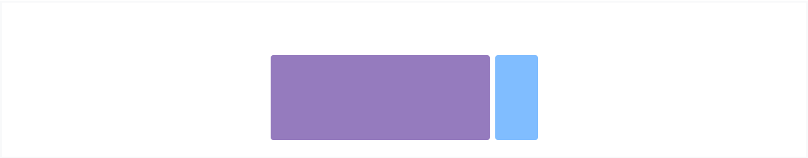
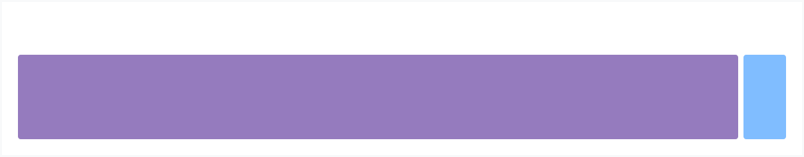

# Layout Overview

Componets and options for laying out your Bootstrap project, including wrapping containers, a powerful grid system, a flexible media object, and responsive utility classes.

## Containers

Containers are the most basic layout element in Bootstrap and are **requireed when using our default grid system**. Choose from a responsive, fixed-width container (meaning its `max-width` changes at each breakpoint) or fluid-width(meaining it's 100% wide all the time).

While containers can be nested, most layouts di bit reqyure a nested container.



```html
<div class="container">
  <!-- Content here -->
</div>
```

Use `.container-fluid` for a full width contrainer, spanning the entire width of the viewport.



```html
<div class="container-fluid">
  ...
</div>
```

## Responsive breakpoints

Since Bootstrap is developed to be mobile first, we use a handful of [media queries](https://developer.mozilla.org/en-US/docs/Web/CSS/Media_Queries/Using_media_queries) to create sensible breakpoints for our layouts and interfaces. These breaskpoints are mostly based on minimum viewpoint widths and allow us to scale up elements as the viewport changes.

Bootstrap primarily uses the following media query ranges- or breakpoints- in our source Sass files for our layout, grid system, and components.

```javascript
// Extra small devices (portrait phones, less than 576px)
// No media query for `xs` since this is the default in Bootstrap

// Small devices (landscape phones, 576px and up)
@media (min-width: 576px) { ... }

// Medium devices (tablets, 768px and up)
@media (min-width: 768px) { ... }

// Large devices (desktops, 992px and up)
@media (min-width: 992px) { ... }

// Extra large devices (large desktops, 1200px and up)
@media (min-width: 1200px) { ... }
```

Since we write out source CSS in Sass, all out media queris are available via Sass mixins:

```javascript
// No media query necessary for xs breakpoint as it's effectively `@media (min-width: 0) { ... }`
@include media-breakpoint-up(sm) { ... }
@include media-breakpoint-up(md) { ... }
@include media-breakpoint-up(lg) { ... }
@include media-breakpoint-up(xl) { ... }

// Example: Hide starting at `min-width: 0`, and then show at the `sm` breakpoint
.custom-class {
  display: none;
}
@include media-breakpoint-up(sm) {
  .custom-class {
    display: block;
  }
}
```

We occasionally use media queries that go in the other direction(the given screen size or smaller)

```javascript
// Extra small devices (portrait phones, less than 576px)
@media (max-width: 575.98px) { ... }

// Small devices (landscape phones, less than 768px)
@media (max-width: 767.98px) { ... }

// Medium devices (tablets, less than 992px)
@media (max-width: 991.98px) { ... }

// Large devices (desktops, less than 1200px)
@media (max-width: 1199.98px) { ... }

// Extra large devices (large desktops)
// No media query since the extra-large breakpoint has no upper bound on its width
```

    Note that since browsers do not currently support [range context queries](https://www.w3.org/TR/mediaqueries-4/#range-context), we work around the limitation of [min- and max- prefixes](https://www.w3.org/TR/mediaqueries-4/#mq-min-max) and viewports with fractional widths.

Once again, These media queries are also available vis Sass mizins:

```javascript
@include media-breakpoint-down(xs) { ... }
@include media-breakpoint-down(sm) { ... }
@include media-breakpoint-down(md) { ... }
@include media-breakpoint-down(lg) { ... }
// No media query necessary for xl breakpoint as it has no upper bound on its width

// Example: Style from medium breakpoint and down
@include media-breakpoint-down(md) {
  .custom-class {
    display: block;
  }
}
```

There aree also media queries and mixins for targeting a single segment of screen sizes using the minimum and maximum breakpoint widths.

```javascript
// Extra small devices (portrait phones, less than 576px)
@media (max-width: 575.98px) { ... }

// Small devices (landscape phones, 576px and up)
@media (min-width: 576px) and (max-width: 767.98px) { ... }

// Medium devices (tablets, 768px and up)
@media (min-width: 768px) and (max-width: 991.98px) { ... }

// Large devices (desktops, 992px and up)
@media (min-width: 992px) and (max-width: 1199.98px) { ... }

// Extra large devices (large desktops, 1200px and up)
@media (min-width: 1200px) { ... }
```

These media queries are also available via Sass mixins:

```javascript
@include media-breakpoint-only(xs) { ... }
@include media-breakpoint-only(sm) { ... }
@include media-breakpoint-only(md) { ... }
@include media-breakpoint-only(lg) { ... }
@include media-breakpoint-only(xl) { ... }
```

Similarly, media queries may span multiple breakpoint widths:

```javascript
// Example
// Apply styles starting from medium devices and up to extra large devices
@media (min-width: 768px) and (max-width: 1199.98px) { ... }
```

The Sass mixin for targeting the same size range would be:

```javascript
@include media-breakpoint-between(md, xl) { ... }
```

## Z - index

Several Bootstrap components utilize `z-index`, the CSS property that helps control layout by providing a third axis to arrange content. We utilize a default z-index scale in Bootstrap that's been designed to property layer navigation, tooltips and popovers, modals, and more.

These higher values start at an arbitrary number, high and specific enough to ideally avoid confilects. We need a standaed set of these across our layered components - tooltips, popovers, navbars, dropdowns, models - so we can be reasonably consistent in the behaviors. There's no reason we couldn't have used 100+ or 500+.

We don't encourage customization of these individual values; should you change one, you likely need to change them all.

```javascript
$zindex-dropdown:          1000 !default;
$zindex-sticky:            1020 !default;
$zindex-fixed:             1030 !default;
$zindex-modal-backdrop:    1040 !default;
$zindex-modal:             1050 !default;
$zindex-popover:           1060 !default;
$zindex-tooltip:           1070 !default;
```

To handle overlapping borders within components, we use low single digit `z-index` values of `1`, `2` and `3` for default, hover, and active states. On hover/forcus/active, we bring a particular element to the foreefont with a higer `z-index` value to show their border over the sibling elements.

<hr/>

Get more information at [here](https://getbootstrap.com/docs/4.3/layout/overview/).
