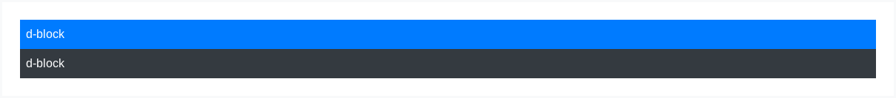

# Display property

Quickly and responsively toggle the display value of components and more with our display utilities Includes support for some of the more common values, as well as some extras for controlling display when printing.

## How it works

Change the value of the [display property](https://getbootstrap.com/docs/4.3/utilities/display/) with our responsive display utility classes. We purposely support only a subset of all possible values for `display`. Classes can be combined for various effects as you need.

## Notation

Display utility class that apply to all [breakpoint](https://getbootstrap.com/docs/4.3/layout/overview/#responsive-breakpoints), from `xs` to `xl`, have no breakpoint abbraviation in them. This is because those classes are applied from `min-width: 0;` and up, and thus are not bound by a media query. The remaining breakpoints, however, do include a breakpoint abbreviation.

As such, the classes are named using the format:

- `.d-{value}` for `xs`
- `.d-{breakpoint}-{value}` for `sm`, `md`, `lg`, and `xl`.

Where _value_ is one of:

- `none`
- `inline`
- `inline-block`
- `block`
- `table`
- `table-cell`
- `table-row`
- `flex`
- `inline-flex`

The display values can be altered by changing the `$display` variable and recompiling the SCSS.

The media queries effect screen widths with the given breakpoint or large.

## Examples


```html
<div class="d-inline p-2 bg-primary text-white">d-inline</div>
<div class="d-inline p-2 bg-dark text-white">d-inline</div>
```



```html
<span class="d-block p-2 bg-primary text-white">d-block</span>
<span class="d-block p-2 bg-dark text-white">d-block</span>
```

## Hiding elements

For faster mobile-friendly developmen, use responsice display classes for showing and hiding elements by devive. Acoid creating entirely different versions of the same site, instead hid elements reponsively for each screen size.

To hid elements simply use the `.d-none` class or one of the `.d-{sm,md,lg,xl}-none` clases for any reponsive screen variation.

To show an element onlu on a given interval of screen sizes yu can combine one `.d-*-none` class with a `.d-*-*` class, for example `.d-none .d-md-block .d-xl-none` will hid the element for all screen sizes except on medium and large devices.


```html
<div class="d-lg-none">hide on screens wider than lg</div>
<div class="d-none d-lg-block">hide on screens smaller than lg</div>
```

## Display in print

Change the `display` value of elements when printing with our print display utility classes. Includes support for the same `display` values as our responsive `.d-*` utilities.

- `.d-print-none`
- `.d-print-inline`
- `.d-print-inline-block`
- `.d-print-block`
- `.d-print-table`
- `.d-print-table-row`
- `.d-print-table-cell`
- `.d-print-flex`
- `.d-print-inline-flex`

The print and display classes can be combined.


```html
<div class="d-print-none">Screen Only (Hide on print only)</div>
<div class="d-none d-print-block">Print Only (Hide on screen only)</div>
<div class="d-none d-lg-block d-print-block">
  Hide up to large on screen, but always show on print
</div>
```

<hr/>

Get more information at [here](https://getbootstrap.com/docs/4.3/utilities/display/).
